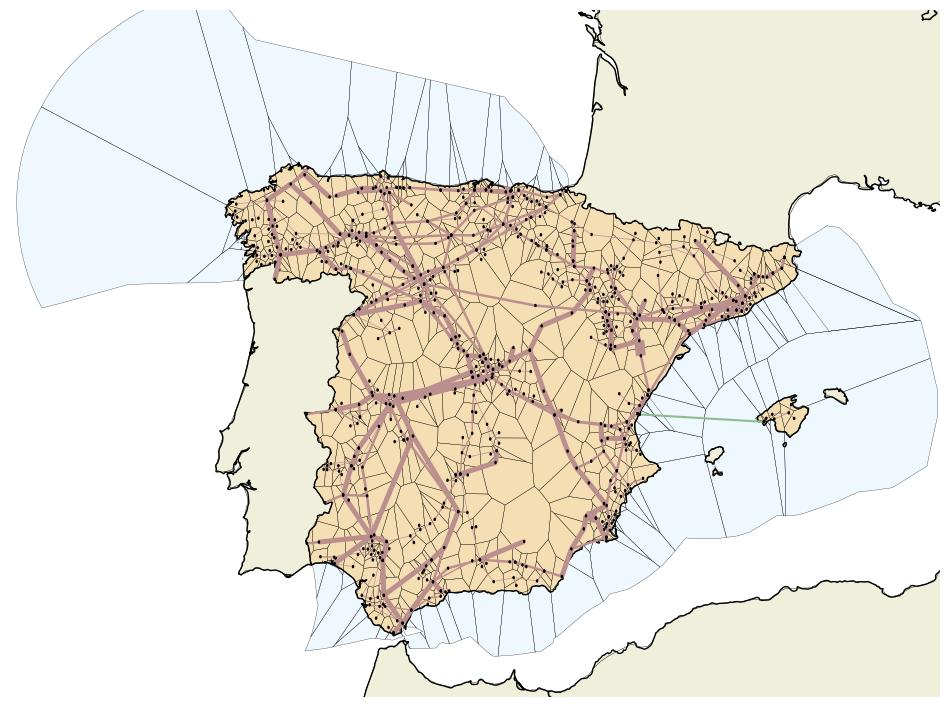

<!--
SPDX-FileCopyrightText: 2017-2024 The PyPSA-Spain Authors
SPDX-License-Identifier: CC-BY-4.0
-->

# PyPSA-Spain: An extension of PyPSA-Eur to model the Spanish Energy System

The primary motivation behind the development of PyPSA-Spain was to leverage the
benefits of a national energy model over a regional one, like the availability of specific
datasets from national organisations. Additionally, a single-country model enables higher
spatial and temporal resolution with the same computational resources due to the smaller
geographical domain. Finally, it does not require assumptions about coordinated action
between countries, making it a more suitable tool for analysing national energy policies.
To accommodate cross-border interactions, a nested model approach with PyPSA-Eur was
used, wherein electricity prices from neighbouring countries are precomputed through the
optimisation of the European energy system.

PyPSA-Spain is an up-to-date fork of PyPSA-Eur, ensuring that advancements
and bug fixes made to PyPSA-Eur are integrated. In addition, PyPSA-Spain includes a number of novel functionalities that enhance the representation
of the Spanish energy system, as compared with PyPSA-Eur. 

Find more details in [https://pypsa-spain.readthedocs.io/en/latest/](https://pypsa-spain.readthedocs.io/en/latest/)

A description of the new functionalities implemented in PyPSA-Spain is now available in this preprint: [https://arxiv.org/abs/2412.06571](https://arxiv.org/abs/2412.06571).

# Licence

PyPSA-Spain is a fork of [PyPSA-Eur](https://github.com/PyPSA/pypsa-eur), which is released as free software under the
[MIT License](https://opensource.org/licenses/MIT), see [`doc/licenses.rst`](doc/licenses.rst).
However, different licenses and terms of use may apply to the various input data.
