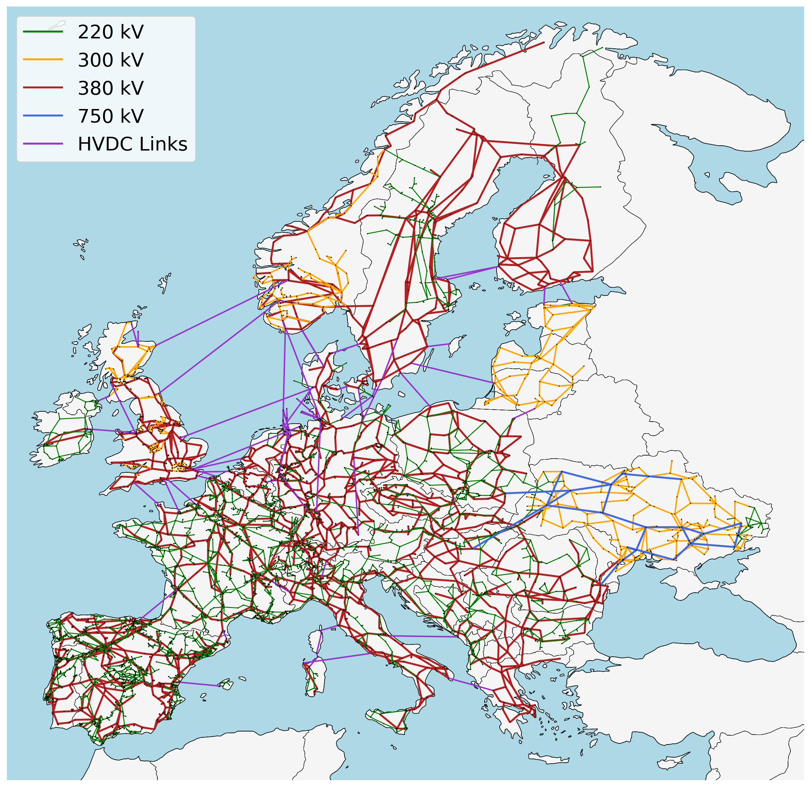

<!--
SPDX-FileCopyrightText: Contributors to PyPSA-Eur <https://github.com/pypsa/pypsa-eur>
SPDX-License-Identifier: CC-BY-4.0
-->

# PyPSA-Eur: A Sector-Coupled Open Optimisation Model of the European Energy System

PyPSA-Eur is an open model dataset of the European energy system at the
transmission network level that covers the full ENTSO-E area and all energy sectors, including transport, heating, biomass, industry, and agriculture.
Besides the power grid, pipeline networks for gas, hydrogen, carbon dioxide, and liquid fuels are included.
The model is suitable both for planning studies and operational studies.
The model is built from open data using a Snakemake workflow and fully open source.
It is designed to be imported into the open-source energy system modelling framework [PyPSA](www.pypsa.org).

> [!NOTE]
> PyPSA-Eur has many contributors, with the maintenance currently led by the [Department of Digital Transformation in
> Energy Systems](https://tu.berlin/en/ensys) at the [Technical University of
> Berlin](https://www.tu.berlin).
> Previous versions were developed at the [Karlsruhe
> Institute of Technology](http://www.kit.edu/english/index.php) funded by the
> [Helmholtz Association](https://www.helmholtz.de/en/).

Among many other things, the dataset consists of:

- A power grid model based on [OpenStreetMap](https://zenodo.org/records/18619025) for voltage levels above 220kV (optional above 60kV).
- The open power plant database
  [powerplantmatching](https://github.com/PyPSA/powerplantmatching).
- Electrical demand time series from the [ENTSO-E Transparency Platform](https://transparency.entsoe.eu/).
- Renewable time series based on ERA5 and SARAH-3, assembled using [atlite](https://github.com/PyPSA/atlite).
- Geographical potentials for wind and solar generators based land eligibility analysis in [atlite](https://github.com/PyPSA/atlite).
- Energy balances compiled from Eurostat and JRC-IDEES datasets.

The high-voltage grid and the power plant fleet are shown in this map of the unclustered model (as of 1 January 2026):

For computational reasons the model is usually clustered down
to 50-250 nodes. The image below shows the electricity network and power plants clustered to NUTS2 regions:

This diagram gives an overview of the sectors and the links between
them within each model region:

# Warnings

PyPSA-Eur is under active development and has several
[limitations](https://pypsa-eur.readthedocs.io/en/latest/limitations.html) which
you should understand before using the model. The github repository
[issues](https://github.com/PyPSA/pypsa-eur/issues) collect known topics we are
working on (please feel free to help or make suggestions). The
[documentation](https://pypsa-eur.readthedocs.io/) remains somewhat patchy. You
can find showcases of the model's capabilities in the Joule paper [The potential
role of a hydrogen network in
Europe](https://doi.org/10.1016/j.joule.2023.06.016), another [paper in Joule
with a description of the industry
sector](https://doi.org/10.1016/j.joule.2022.04.016), or in [a 2021 presentation
at EMP-E](https://nworbmot.org/energy/brown-empe.pdf). We do not recommend to
use the full resolution network model for simulations. At high granularity the
assignment of loads and generators to the nearest network node may not be a
correct assumption, depending on the topology of the underlying distribution
grid, and local grid bottlenecks may cause unrealistic load-shedding or
generator curtailment. We recommend to cluster the network to a couple of
hundred nodes to remove these local inconsistencies. See the discussion in
Section 3.4 "Model validation" of the paper.

# Contributing and Support
We strongly welcome anyone interested in contributing to this project. If you have any ideas, suggestions or encounter problems, feel invited to file issues or make pull requests on GitHub.
-   To **discuss** with other PyPSA users, organise projects, share news, and get in touch with the community you can use the [Discord server](https://discord.gg/AnuJBk23FU).
-   For **bugs and feature requests**, please use the [PyPSA-Eur Github Issues page](https://github.com/PyPSA/pypsa-eur/issues).

# Licence

The code in PyPSA-Eur is released as free software under the
[MIT License](https://opensource.org/licenses/MIT), see [`doc/licenses.rst`](doc/licenses.rst).
However, different licenses and terms of use may apply to the various
input data, see [`doc/data_sources.rst`](doc/data_sources.rst).
