<!--
SPDX-FileCopyrightText: 2017-2024 The PyPSA-Eur Authors
SPDX-License-Identifier: CC-BY-4.0
-->

# PyPSA-Eur: A Sector-Coupled Open Optimisation Model of the European Energy System

The model is described in the [documentation](https://pypsa-eur.readthedocs.io)
and in the paper
[PyPSA](https://github.com/PyPSA/PyPSA).


# Devcontainers

For details about dev containers see [Dev Containers](https://containers.dev).

This repository is an attempt to use pre-built images to speed up development. Learn more at the [Dev Containers Guide](https://containers.dev/guide/prebuild), inspired by the repository [kubernetes-devcontainer](https://github.com/craiglpeters/kubernetes-devcontainer).

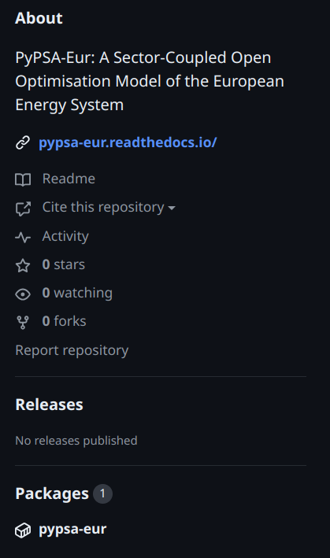

Link to the package: [pypsa-eur](https://github.com/drifter089/pypsa-eur/pkgs/container/pypsa-eur).

## Steps

1. You need [Visual Studio Code](https://code.visualstudio.com/) installed.
2. Install Docker: [Install Docker](https://code.visualstudio.com/docs/devcontainers/tutorial#_install-docker).
3. Install the Dev Containers extension for VS Code: [Install the Extension](https://code.visualstudio.com/docs/devcontainers/tutorial#_install-the-extension).
4. Clone this repo and open it in VS Code.
5. Hit `Ctrl+Shift+P` to open the command palette in VS Code and search for "Dev Containers".
   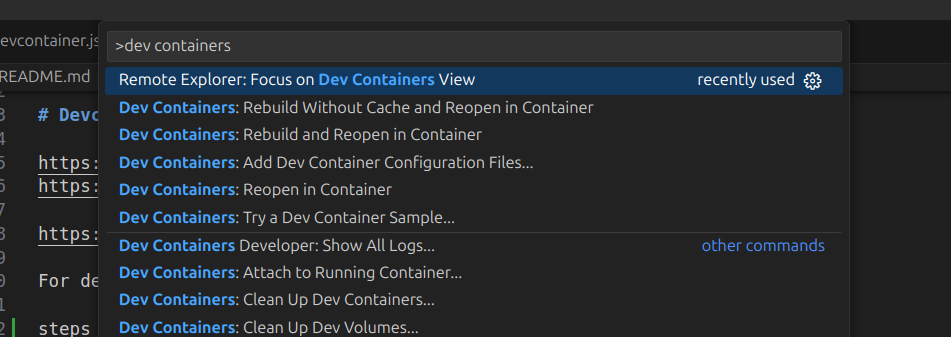
6. Wait for the image to be downloaded.
   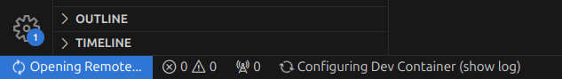
7. Once finished, you will be inside the container.
   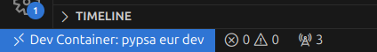
8. Inside the container, you can see the welcome message.
   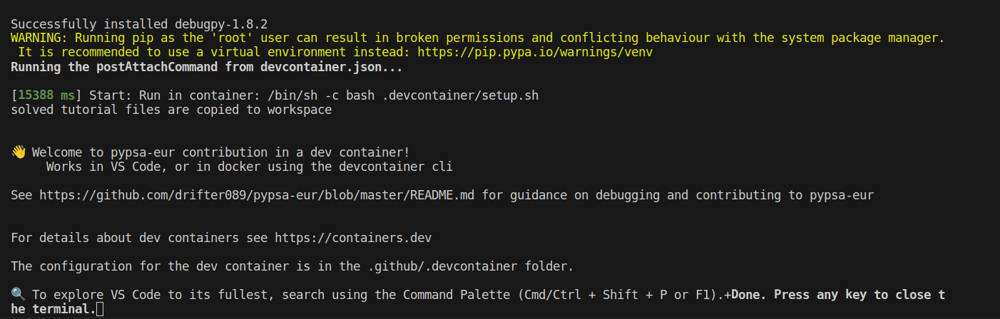
9. Open the terminal and see that the `pypsa-eur` environment is pre-configured.
   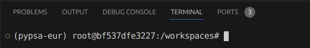
10. Navigate to the files to see the solved folders for the electricity tutorial copied from the container.
    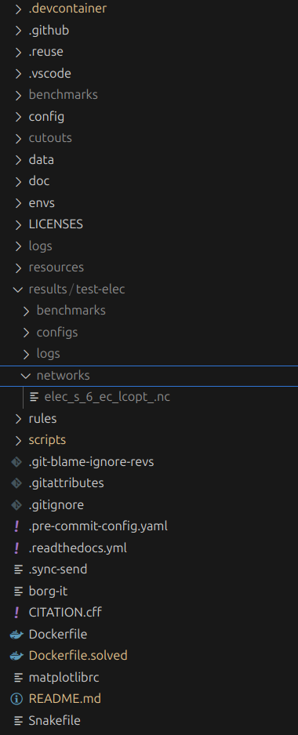


# Debug

Addressing issues like these [Stack Overflow](https://stackoverflow.com/questions/78677266/how-to-debug-scripts-for-pypsa-eur).

Here I attempt to propose a debugging guide where we can use Snakemake commands to specify config and stop execution in the middle with `debugpy` and attach using VS Code debugger.

More detailed guide: [VS Code Python Debugging](https://code.visualstudio.com/docs/python/debugging#_example).

These steps can be followed whether you are using the devcontainers or not.

1. Let's say you have [electricity tutorial](https://pypsa-eur.readthedocs.io/en/latest/tutorial.html) already ran successfully.
2. Let's delete the results folder:

```
sudo rm -r results
```

3. Now, if we want to rebuild the results folder and resulting networks in debug mode:
   - First, let's navigate to the 'scripts/solvenetwork.py' reference file [solve_network.py](https://github.com/drifter089/pypsa-eur/blob/master/scripts/solve_network.py).
   
   - Import `debugpy` 
   
   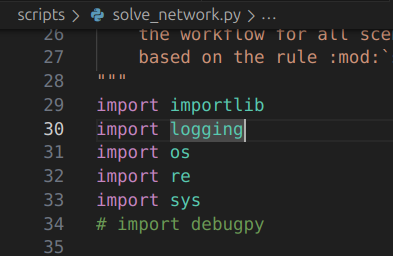.
   
   - Add code snippet to stop execution and wait for the debugger 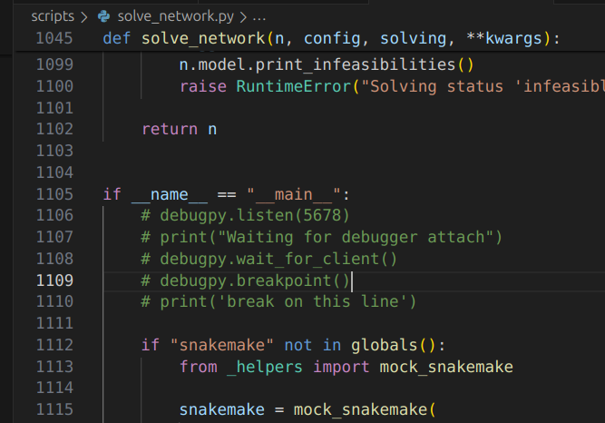.
   

4. Instead of using this command:
```
snakemake -call results/test-elec/networks/elec_s_6_ec_lcopt_.nc --configfile config/test/config.electricity.yaml
```

5. We have to modify it to use one core only and pass the `--debug` flag to Snakemake:

```
snakemake --cores 1 results/test-elec/networks/elec_s_6_ec_lcopt_.nc --configfile config/test/config.electricity.yaml --debug
```

   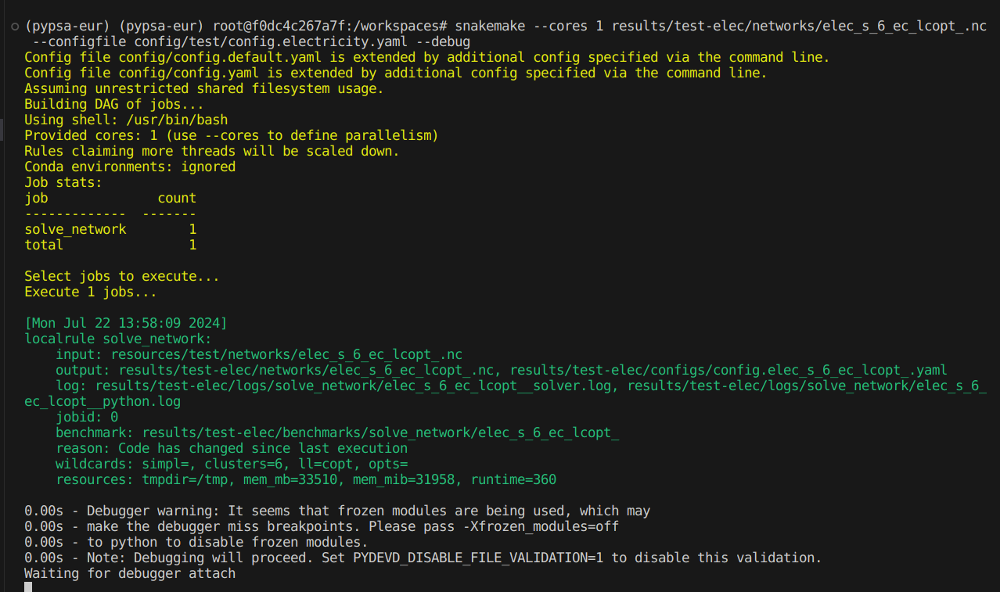

6. Navigate to the "Run and Debug" tab in VS Code and use the debugger attach configuration to launch the debugger, file link [launch.json](https://github.com/drifter089/pypsa-eur/blob/master/.vscode/launch.json).

   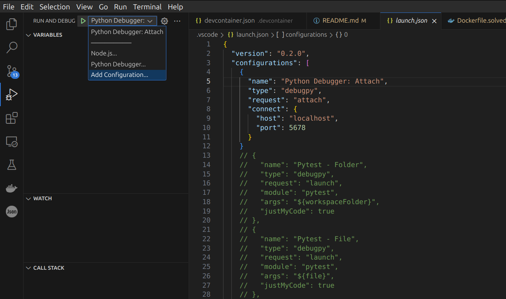

7. Once launched, the debugger will attach to paused code. From here on, you can add breakpoints to the code and use the debugger UI.

   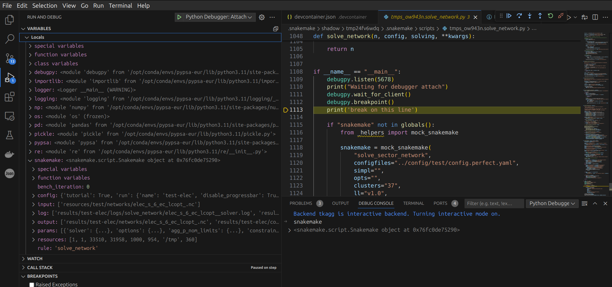


# Contributing and Support

We strongly welcome anyone interested in contributing to this project. If you have any ideas, suggestions or encounter problems, feel invited to file issues or make pull requests on GitHub.

- In case of code-related **questions**, please post on [stack overflow](https://stackoverflow.com/questions/tagged/pypsa).
- For non-programming related and more general questions please refer to the [mailing list](https://groups.google.com/group/pypsa).
- To **discuss** with other PyPSA users, organise projects, share news, and get in touch with the community you can use the [discord server](https://discord.com/invite/AnuJBk23FU).
- For **bugs and feature requests**, please use the [PyPSA-Eur Github Issues page](https://github.com/PyPSA/pypsa-eur/issues).

# Licence

The code in PyPSA-Eur is released as free software under the
[MIT License](https://opensource.org/licenses/MIT), see [`doc/licenses.rst`](doc/licenses.rst).
However, different licenses and terms of use may apply to the various
input data.
