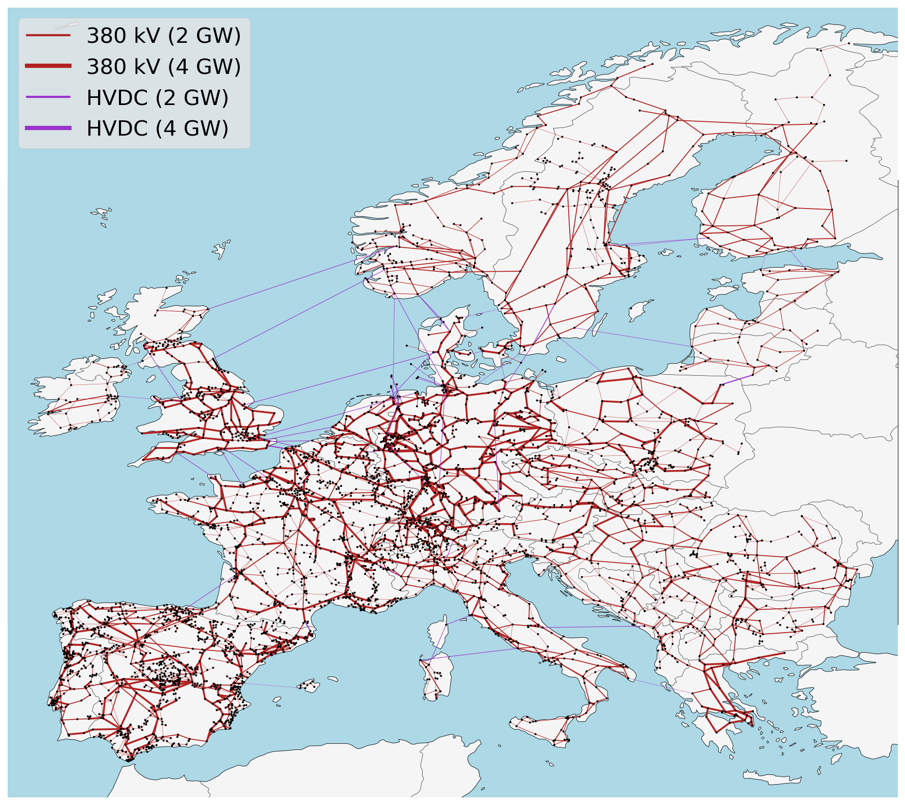
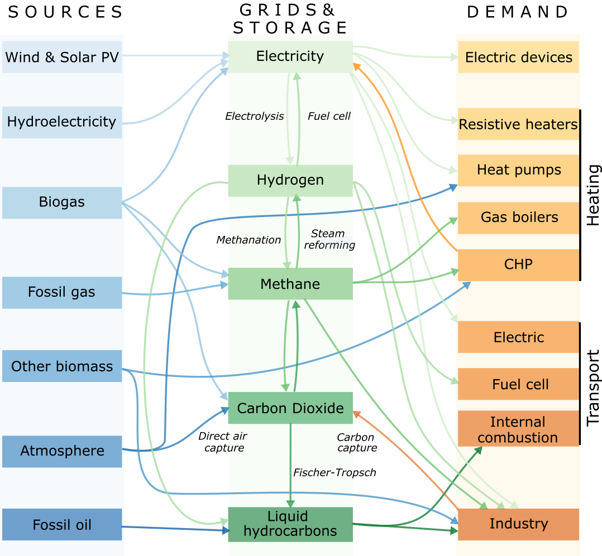

<!--
SPDX-FileCopyrightText: Contributors to PyPSA-Eur <https://github.com/pypsa/pypsa-eur>
SPDX-License-Identifier: CC-BY-4.0
-->

> [!IMPORTANT]
> **Master Thesis Fork — Felicia & Philipp, DTU, 2026**
>
> This is a modified version of PyPSA-Eur used for our Master's thesis at the Technical University of Denmark (DTU). The model has been extended to investigate **Carbon Dioxide Removal (CDR)** technologies and their role in the European energy system transition.
>
> Every thesis contribution is mapped to the exact code that implements it in
> [`CONTRIBUTIONS.md`](CONTRIBUTIONS.md) — a code map separating our additions
> (CDR credit accounting, sequestration economics, DAC enhancements, and the
> supply-curve results) from upstream PyPSA-Eur.
>
> For the original PyPSA-Eur model, see [PyPSA/pypsa-eur](https://github.com/PyPSA/pypsa-eur).

# PyPSA-Eur: A Sector-Coupled Open Optimisation Model of the European Energy System

PyPSA-Eur is an open model dataset of the European energy system at the
transmission network level that covers the full ENTSO-E area. The model is suitable both for operational studies and generation and transmission expansion planning studies.
The continental scope and highly resolved spatial scale enables a proper description of the long-range
smoothing effects for renewable power generation and their varying resource availability.

The model is described in the [documentation](https://pypsa-eur.readthedocs.io)
and in the paper
[PyPSA-Eur: An Open Optimisation Model of the European Transmission
System](https://arxiv.org/abs/1806.01613), 2018,
[arXiv:1806.01613](https://arxiv.org/abs/1806.01613).
The model building routines are defined through a snakemake workflow.
The model is designed to be imported into the open toolbox
[PyPSA](https://github.com/PyPSA/PyPSA).

The dataset consists of:

- A grid model based on a modified [GridKit](https://github.com/bdw/GridKit)
  extraction of the [ENTSO-E Transmission System
  Map](https://www.entsoe.eu/data/map/). The grid model contains 7072 lines
  (alternating current lines at and above 220kV voltage level and all high
  voltage direct current lines) and 3803 substations.
- The open power plant database
  [powerplantmatching](https://github.com/PyPSA/powerplantmatching).
- Electrical demand time series from the
  [OPSD project](https://open-power-system-data.org/).
- Renewable time series based on ERA5 and SARAH, assembled using the [atlite tool](https://github.com/PyPSA/atlite).
- Geographical potentials for wind and solar generators based on land use (CORINE) and excluding nature reserves (Natura2000) are computed with the [atlite library](https://github.com/PyPSA/atlite).

A sector-coupled extension adds demand
and supply for the following sectors: transport, space and water
heating, biomass, industry and industrial feedstocks, agriculture,
forestry and fishing. This completes the energy system and includes
all greenhouse gas emitters except waste management and land use.

This diagram gives an overview of the sectors and the links between them:

# Licence

The code in PyPSA-Eur is released as free software under the
[MIT License](https://opensource.org/licenses/MIT), see [`doc/licenses.rst`](doc/licenses.rst).
However, different licenses and terms of use may apply to the various
input data, see [`doc/data_sources.rst`](doc/data_sources.rst).
