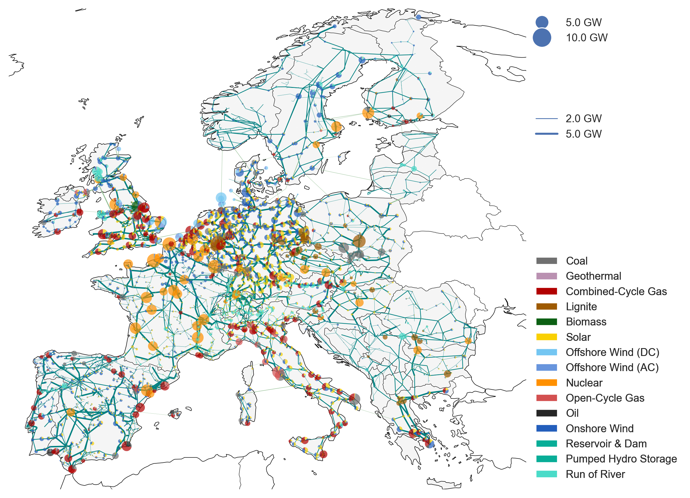

<!--
SPDX-FileCopyrightText: Contributors to PyPSA-Eur <https://github.com/pypsa/pypsa-eur>
SPDX-FileCopyrightText: Open Energy Transition gGmbH
SPDX-License-Identifier: CC-BY-4.0
-->


[](https://github.com/pypsa/pypsa-eur/actions/workflows/test.yaml)
[](https://pypsa-eur.readthedocs.io/en/latest/?badge=latest)

[](https://doi.org/10.5281/zenodo.3520874)
[](https://doi.org/10.5281/zenodo.3938042)
[](https://snakemake.readthedocs.io)
[](https://discord.gg/AnuJBk23FU)
[](https://api.reuse.software/info/github.com/pypsa/pypsa-eur)

# {{project_name}}


This repository is a soft-fork of [PyPSA-Eur](https://github.com/pypsa/pypsa-eur) and contains the entire project `{{project_name}}` supported by [Open Energy Transition (OET)](https://openenergytransition.org/)<sup>*</sup>, including code and report. The philosophy behind this repository is that no intermediary results are included, but all results are computed from raw data and code. The structure is also inspired by [cookiecutter-project](https://github.com/PyPSA/cookiecutter-project).

This repository is maintained using [OET's soft-fork strategy](https://open-energy-transition.github.io/handbook/docs/Engineering/SoftForkStrategy). OET's primary aim is to contribute as much as possible to the open source (OS) upstream repositories. For long-term changes that cannot be directly merged upstream, the strategy organizes and maintains OET forks, ensuring they remain up-to-date and compatible with upstream, while also supporting future contributions back to the OS repositories.


# Repository structure

* `benchmarks`: will store `snakemake` benchmarks (does not exist initially)
* `config`: configurations used in the study
* `cutouts`: will store raw weather data cutouts from `atlite` (does not exist initially)
* `data`: includes input data that is not produced by any `snakemake` rule
* `doc`: includes all files necessary to build the `readthedocs` documentation of PyPSA-Eur
* `envs`: includes backup `conda` environments if `pixi` installation does not work.
* `logs`: will store log files (does not exist initially)
* `notebooks`: includes all the `notebooks` used for ad-hoc analysis
* `report`: contains all files necessary to build the report; plots and result files are generated automatically
* `rules`: includes all the `snakemake`rules loaded in the `Snakefile`
* `resources`: will store intermediate results of the workflow which can be picked up again by subsequent rules (does not exist initially)
* `results`: will store the solved PyPSA network data, summary files and plots (does not exist initially)
* `scripts`: includes all the Python scripts executed by the `snakemake` rules to build the model

# Installation and Usage

## 1. Installation

Clone the repository:

```sh
git clone https://github.com/open-energy-transition/{{repository}}
```

You need [pixi](https://pixi.sh/latest/) to run the analysis.
Once installed, activate your pixi environment in a terminal session:

```sh
pixi shell
```

>[!NOTE]
>`pixi` will create a distinct environment in every project directory, even if you have identical copies of a project cloned locally.
>As there is a common system-level package cache, `pixi` efficiently conserves disk space in such cases.

>[!TIP]
>If `pixi` isn't working, you can install from one of the fallback `conda` environment files found in `envs`.
>For more details see [the PyPSA-Eur installation guide](https://pypsa-eur.readthedocs.io/en/latest/installation.html).

### Extra soft-fork dependencies

If you add dependencies to your project, we recommend you add them to a [new `pixi` environment](https://pixi.sh/v0.21.1/features/multi_environment/#feature-environment-set-definitions).
For instance, if you need access to `plotly`, want to pin the version of gurobi you are using, and want to add a PyPI dependency:

```sh
pixi add -f {{ project_short_name }} "gurobi<13" "plotly"
pixi add -f {{ project_short_name }} --pypi pypsa-explorer
```

This will create these entries in your `pixi.toml`

```toml
[feature.{{ project_short_name }}.pypi-dependencies]
pypsa-explorer = "*"

[feature.{{ project_short_name }}.dependencies]
gurobi = "<13"
plotly = "*"
```

Then, you can create an environment from this feature in `pixi.toml`:

```toml
[environments]
...
{{ project_short_name }} = [{{ project_short_name }}]
```

These dependencies will be combined with the core PyPSA-Eur dependencies and can be accessed by calling:

```sh
pixi shell -e {{ project_short_name }}
```

#### Updating CI tests

To run CI tests using your environment you should add the `test` feature to it and create test tasks for your environment, e.g.:

```toml
[feature.{{ project_short_name }}.tasks]
{{ project_short_name }}-test = """
	snakemake --configfile config/config.{{ project_short_name }}.default.yaml -n &&
    """
[environments]
...
{{ project_short_name }} = ["test", {{ project_short_name }}]
```

And then update `.github/workflows/test.yaml` to run that test:

```yaml
- name: Run project-specific snakemake test workflows
  run: |
    pixi run {{ project_short_name }}-test
```

If you also add your own unit tests, update the unit test runner to use your environment as well:

```yaml
- name: Run unit tests
  run: |
    pixi run -e {{ project_short_name }} unit-tests
```


## 2. Run the analysis

```sh
snakemake -call
```

This will run all analysis steps to reproduce results and build the report.

To generate a PDF of the dependency graph of all steps `resources/dag.pdf` run:

```sh
snakemake -c1 dag
```

<sup>*</sup> Open Energy Transition (g)GmbH, Königsallee 52, 95448 Bayreuth, Germany

----

----

# PyPSA-Eur: A Sector-Coupled Open Optimisation Model of the European Energy System

PyPSA-Eur is an open model dataset of the European energy system at the
transmission network level that covers the full ENTSO-E area. The model is suitable both for operational studies and generation and transmission expansion planning studies.
The continental scope and highly resolved spatial scale enables a proper description of the long-range
smoothing effects for renewable power generation and their varying resource availability.


The model is described in the [documentation](https://pypsa-eur.readthedocs.io)
and in the paper
[PyPSA-Eur: An Open Optimisation Model of the European Transmission
System](https://arxiv.org/abs/1806.01613), 2018,
[arXiv:1806.01613](https://arxiv.org/abs/1806.01613).
The model building routines are defined through a snakemake workflow.
Please see the [documentation](https://pypsa-eur.readthedocs.io/)
for installation instructions and other useful information about the snakemake workflow.
The model is designed to be imported into the open toolbox
[PyPSA](https://github.com/PyPSA/PyPSA).

**WARNING**: PyPSA-Eur is under active development and has several
[limitations](https://pypsa-eur.readthedocs.io/en/latest/limitations.html) which
you should understand before using the model. The github repository
[issues](https://github.com/PyPSA/pypsa-eur/issues) collect known topics we are
working on (please feel free to help or make suggestions). The
[documentation](https://pypsa-eur.readthedocs.io/) remains somewhat patchy. You
can find showcases of the model's capabilities in the Joule paper [The potential
role of a hydrogen network in
Europe](https://doi.org/10.1016/j.joule.2023.06.016), another [paper in Joule
with a description of the industry
sector](https://doi.org/10.1016/j.joule.2022.04.016), or in [a 2021 presentation
at EMP-E](https://nworbmot.org/energy/brown-empe.pdf). We do not recommend to
use the full resolution network model for simulations. At high granularity the
assignment of loads and generators to the nearest network node may not be a
correct assumption, depending on the topology of the underlying distribution
grid, and local grid bottlenecks may cause unrealistic load-shedding or
generator curtailment. We recommend to cluster the network to a couple of
hundred nodes to remove these local inconsistencies. See the discussion in
Section 3.4 "Model validation" of the paper.




The dataset consists of:

- A grid model based on a modified [GridKit](https://github.com/bdw/GridKit)
  extraction of the [ENTSO-E Transmission System
  Map](https://www.entsoe.eu/data/map/). The grid model contains 7072 lines
  (alternating current lines at and above 220kV voltage level and all high
  voltage direct current lines) and 3803 substations.
- The open power plant database
  [powerplantmatching](https://github.com/PyPSA/powerplantmatching).
- Electrical demand time series from the
  [OPSD project](https://open-power-system-data.org/).
- Renewable time series based on ERA5 and SARAH, assembled using the [atlite tool](https://github.com/PyPSA/atlite).
- Geographical potentials for wind and solar generators based on land use (CORINE) and excluding nature reserves (Natura2000) are computed with the [atlite library](https://github.com/PyPSA/atlite).

A sector-coupled extension adds demand
and supply for the following sectors: transport, space and water
heating, biomass, industry and industrial feedstocks, agriculture,
forestry and fishing. This completes the energy system and includes
all greenhouse gas emitters except waste management and land use.

This diagram gives an overview of the sectors and the links between
them:


Each of these sectors is built up on the transmission network nodes
from [PyPSA-Eur](https://github.com/PyPSA/pypsa-eur):


For computational reasons the model is usually clustered down
to 50-200 nodes.

Already-built versions of the model can be found in the accompanying [Zenodo
repository](https://doi.org/10.5281/zenodo.3601881).

# Contributing and Support
We strongly welcome anyone interested in contributing to this project. If you have any ideas, suggestions or encounter problems, feel invited to file issues or make pull requests on GitHub.
-   To **discuss** with other PyPSA users, organise projects, share news, and get in touch with the community you can use the [Discord server](https://discord.gg/AnuJBk23FU).
-   For **bugs and feature requests**, please use the [PyPSA-Eur Github Issues page](https://github.com/PyPSA/pypsa-eur/issues).

# Licence

The code in PyPSA-Eur is released as free software under the
[MIT License](https://opensource.org/licenses/MIT), see [`doc/licenses.rst`](doc/licenses.rst).
However, different licenses and terms of use may apply to the various
input data, see [`doc/data_sources.rst`](doc/data_sources.rst).