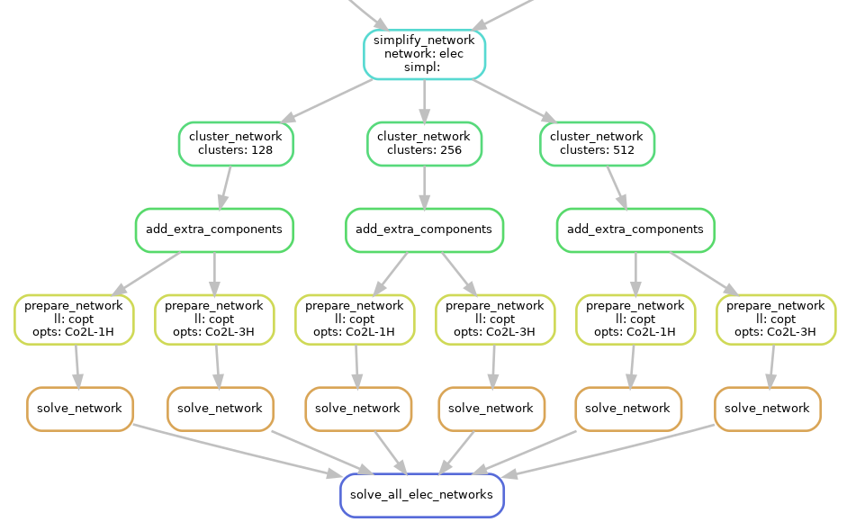

..
  SPDX-FileCopyrightText: 2019-2022 The PyPSA-Eur Authors

  SPDX-License-Identifier: CC-BY-4.0

.. _config:

##########################################
Configuration
##########################################

PyPSA-Eur has several configuration options which are documented in this section and are collected in a ``config.yaml`` file located in the root directory. Users should copy the provided default configuration (``config.default.yaml``) and amend their own modifications and assumptions in the user-specific configuration file (``config.yaml``); confer installation instructions at :ref:`defaultconfig`.

.. _toplevel_cf:

Top-level configuration
=======================

.. literalinclude:: ../config.default.yaml
   :language: yaml
   :lines: 5-12,20,31-38

.. csv-table::
   :header-rows: 1
   :widths: 25,7,22,30
   :file: configtables/toplevel.csv

.. _scenario:

``run``
=======

It is common conduct to analyse energy system optimisation models for **multiple scenarios** for a variety of reasons,
e.g. assessing their sensitivity towards changing the temporal and/or geographical resolution or investigating how
investment changes as more ambitious greenhouse-gas emission reduction targets are applied.

The ``run`` section is used for running and storing scenarios with different configurations which are not covered by :ref:`wildcards`. It determines the path at which resources, networks and results are stored. Therefore the user can run different configurations within the same directory. If a run with a non-empty name should use cutouts shared across runs, set ``shared_cutouts`` to `true`.    

.. literalinclude:: ../config.default.yaml
   :language: yaml
   :start-at: run:
   :end-before: scenario:

``scenario``
============

The ``scenario`` section is an extraordinary section of the config file
that is strongly connected to the :ref:`wildcards` and is designed to
facilitate running multiple scenarios through a single command

.. code:: bash

    snakemake -j 1 solve_all_networks

For each wildcard, a **list of values** is provided. The rule ``solve_all_networks`` will trigger the rules for creating ``results/networks/elec_s{simpl}_{clusters}_ec_l{ll}_{opts}.nc`` for **all combinations** of the provided wildcard values as defined by Python's `itertools.product(...) <https://docs.python.org/2/library/itertools.html#itertools.product>`_ function that snakemake's `expand(...) function <https://snakemake.readthedocs.io/en/stable/snakefiles/rules.html#targets>`_ uses.

An exemplary dependency graph (starting from the simplification rules) then looks like this:

.. literalinclude:: ../config.default.yaml
   :language: yaml
   :start-at: scenario:
   :end-before: countries:

.. csv-table::
   :header-rows: 1
   :widths: 25,7,22,30
   :file: configtables/scenario.csv

.. _snapshots_cf:

``snapshots``
=============

Specifies the temporal range to build an energy system model for as arguments to `pandas.date_range <https://pandas.pydata.org/pandas-docs/stable/reference/api/pandas.date_range.html>`_

.. literalinclude:: ../config.default.yaml
   :language: yaml
   :start-at: snapshots:
   :end-before: enable:

.. csv-table::
   :header-rows: 1
   :widths: 25,7,22,30
   :file: configtables/snapshots.csv

.. _electricity_cf:

``electricity``
===============

.. literalinclude:: ../config.default.yaml
   :language: yaml
   :start-at: electricity:
   :end-before: atlite:

.. csv-table::
   :header-rows: 1
   :widths: 25,7,22,30
   :file: configtables/electricity.csv

.. _atlite_cf:

``atlite``
==========

Define and specify the ``atlite.Cutout`` used for calculating renewable potentials and time-series. All options except for ``features`` are directly used as `cutout parameters <https://atlite.readthedocs.io/en/latest/ref_api.html#cutout>`_. 

.. literalinclude:: ../config.default.yaml
   :language: yaml
   :start-at: atlite:
   :end-before: renewable:

.. csv-table::
   :header-rows: 1
   :widths: 25,7,22,30
   :file: configtables/atlite.csv

.. _renewable_cf:

``renewable``
=============

``onwind``
----------

.. literalinclude:: ../config.default.yaml
   :language: yaml
   :start-at: renewable:
   :end-before:   offwind-ac:

.. csv-table::
   :header-rows: 1
   :widths: 25,7,22,30
   :file: configtables/onwind.csv

``offwind-ac``
--------------

.. literalinclude:: ../config.default.yaml
   :language: yaml
   :start-at:   offwind-ac:
   :end-before:   offwind-dc:

.. csv-table::
   :header-rows: 1
   :widths: 25,7,22,30
   :file: configtables/offwind-ac.csv

``offwind-dc``
---------------

.. literalinclude:: ../config.default.yaml
   :language: yaml
   :start-at:   offwind-dc:
   :end-before:   solar:

.. csv-table::
   :header-rows: 1
   :widths: 25,7,22,30
   :file: configtables/offwind-dc.csv

``solar``
---------------

.. literalinclude:: ../config.default.yaml
   :language: yaml
   :start-at:   solar:
   :end-before:   hydro:

.. csv-table::
   :header-rows: 1
   :widths: 25,7,22,30
   :file: configtables/solar.csv

``hydro``
---------------

.. literalinclude:: ../config.default.yaml
   :language: yaml
   :start-at:   hydro:
   :end-before: conventional:

.. csv-table::
   :header-rows: 1
   :widths: 25,7,22,30
   :file: configtables/hydro.csv

.. _lines_cf:

``conventional``
=============

Define additional generator attribute for conventional carrier types. If a scalar value is given it is applied to all generators. However if a string starting with "data/" is given, the value is interpreted as a path to a csv file with country specific values. Then, the values are read in and applied to all generators of the given carrier in the given country. Note that the value(s) overwrite the existing values in the corresponding section of the ``generators`` dataframe.   

.. literalinclude:: ../config.default.yaml
   :language: yaml
   :start-at:   conventional:
   :end-before: lines:

``lines``
=============

.. literalinclude:: ../config.default.yaml
   :language: yaml
   :start-at: lines:
   :end-before: links:

.. csv-table::
   :header-rows: 1
   :widths: 25,7,22,30
   :file: configtables/lines.csv

.. _links_cf:

``links``
=============

.. literalinclude:: ../config.default.yaml
   :language: yaml
   :start-at: links:
   :end-before: transformers:

.. csv-table::
   :header-rows: 1
   :widths: 25,7,22,30
   :file: configtables/links.csv

.. _transformers_cf:

``transformers``
================

.. literalinclude:: ../config.default.yaml
   :language: yaml
   :start-at: transformers:
   :end-before: load:

.. csv-table::
   :header-rows: 1
   :widths: 25,7,22,30
   :file: configtables/transformers.csv

.. _load_cf:

``load``
=============

.. literalinclude:: ../config.default.yaml
   :language: yaml
   :lines: 212-217

.. csv-table::
   :header-rows: 1
   :widths: 25,7,22,30
   :file: configtables/load.csv

.. _costs_cf:

``costs``
=============

.. literalinclude:: ../config.default.yaml
   :language: yaml
   :start-after: scaling_factor:
   :end-before: clustering:

.. csv-table::
   :header-rows: 1
   :widths: 25,7,22,30
   :file: configtables/costs.csv

.. note::
    To change cost assumptions in more detail (i.e. other than ``marginal_cost`` and ``capital_cost``), consider modifying cost assumptions directly in ``resources/costs.csv`` as this is not yet supported through the config file.
    You can also build multiple different cost databases. Make a renamed copy of ``resources/costs.csv`` (e.g. ``data/costs-optimistic.csv``) and set the variable ``COSTS=data/costs-optimistic.csv`` in the ``Snakefile``.

.. _clustering_cf:

``clustering``
==============

.. literalinclude:: ../config.default.yaml
   :language: yaml
   :start-after:     co2:
   :end-before: solving:

.. csv-table::
   :header-rows: 1
   :widths: 25,7,22,30
   :file: configtables/clustering.csv

.. _solving_cf:

``solving``
=============

``options``
-----------

.. literalinclude:: ../config.default.yaml
   :language: yaml
   :start-at: solving:
   :end-before:   solver:

.. csv-table::
   :header-rows: 1
   :widths: 25,7,22,30
   :file: configtables/solving-options.csv

``solver``
----------

.. literalinclude:: ../config.default.yaml
   :language: yaml
   :start-at:   solver:
   :end-before: plotting:

.. csv-table::
   :header-rows: 1
   :widths: 25,7,22,30
   :file: configtables/solving-solver.csv

.. _plotting_cf:

``plotting``
=============

.. literalinclude:: ../config.default.yaml
   :language: yaml
   :start-at: plotting:

.. csv-table::
   :header-rows: 1
   :widths: 25,7,22,30
   :file: configtables/plotting.csv
