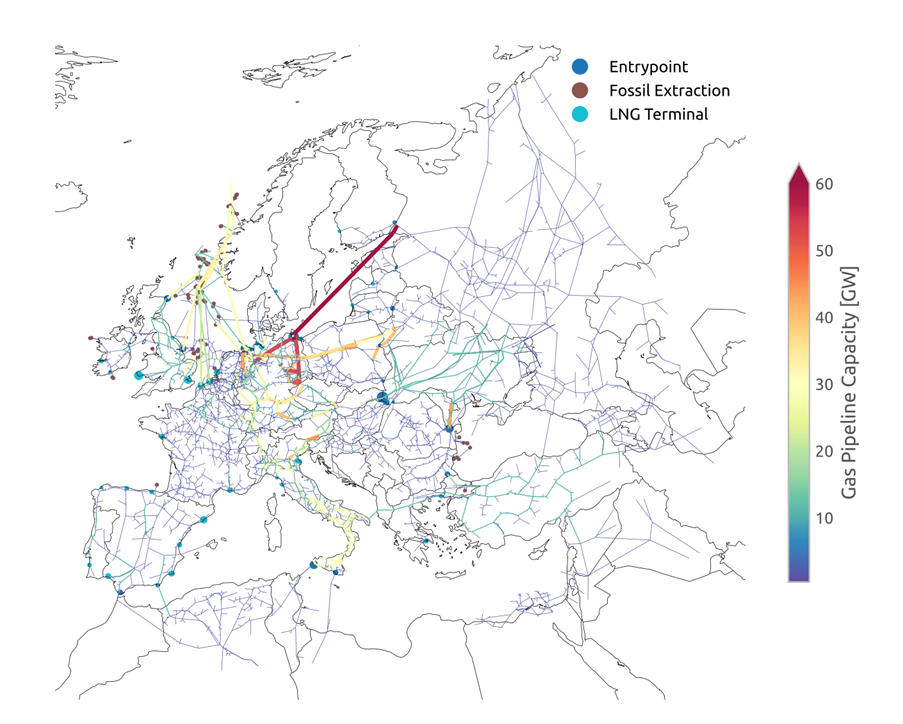

<!-- SPDX-FileCopyrightText: Contributors to PyPSA-Eur <https://github.com/pypsa/pypsa-eur> -->
<!-- SPDX-License-Identifier: CC-BY-4.0 -->

# Methane {#design-methane}

{{ scope(electricity="partial") }}

Methane is the carrier behind today's natural gas system. In the model it is a
single carrier regardless of its origin, so that fossil gas, upgraded biogas
and synthetic methane compete on cost and emissions at the same bus.

=== "Sector-coupled"

    Methane is a full carrier with the demands, sources, storage and network
    described on this page.

=== "Electricity-only"

    There is no methane bus. Gas power plants are generators with a fuel
    price and a carbon intensity.

## Demand

Methane fuels gas boilers in buildings and district heating, combined heat
and power plants, open and combined cycle gas turbines, steam methane
reforming, and high-temperature process heat in industry. It is not used in
transport. Gas delivered to buildings incurs the cost of the gas distribution
grid.

## Supply

- **Fossil gas** enters at LNG terminals [@gemwikiLNGTerminals2021],
  pipeline entry points from outside Europe and domestic production sites,
  each limited by its capacity, when the gas network is regionally resolved,
  otherwise at a single European node.
- **Biogas** from manure and sludge is upgraded to methane quality before it
  joins the network, optionally capturing the CO~2~ removed in upgrading, see
  [Biomass](biomass.md). Solid biomass can also be gasified to synthetic
  natural gas.
- **Synthetic methane** is produced from hydrogen and captured CO~2~ by
  methanation.
- **Imports** of methane from outside Europe at a fixed price can be enabled.

The mix of these sources is a result of the optimisation and of the emission
limits.

## Storage

Existing underground gas storage sites enter with their capacities from the
gas network dataset, so that seasonal balancing of methane is represented
where it exists today.

## Transport

The existing European gas transmission network is built from an open dataset
that merges published network maps [@plutaSciGRIDGas2022a; @entsogTransmissionCapacity2021]; pipeline capacities are inferred from
diameter and pressure where they are not reported. The network is clustered to
the model regions like the electricity grid. Gas flows are a transport model
without pressure dynamics; the electricity demand of compression per distance
can be represented. Existing pipelines are not expanded; new pipelines are
only added where needed to keep the clustered network connected. The existing
pipelines are the retrofit candidates for hydrogen transport, see
[Hydrogen](hydrogen.md).

Because future methane demand is expected to be small compared to the
existing capacity, the gas network can also be switched off. Then methane is
copperplated and the network only serves to determine the retrofit
potential.

## Further reading

- Rules: [build_gas_network][], [build_gas_input_locations][],
  [cluster_gas_network][]
- Configuration: [sector](../configuration.md#sector_cf), in particular
  `gas_network`, `methanation`, `biosng` and `gas_distribution_grid`
