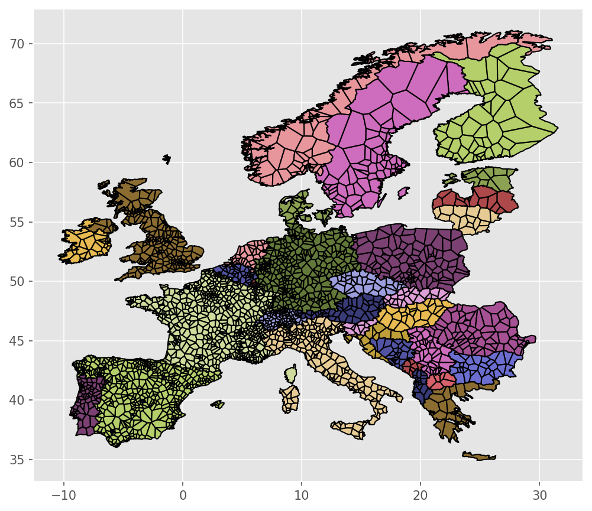
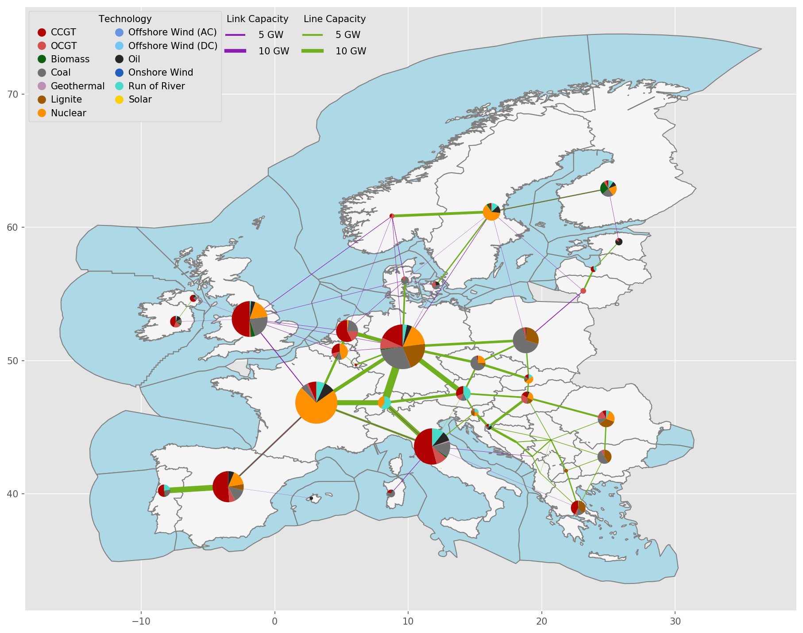

<!-- SPDX-FileCopyrightText: Contributors to PyPSA-Eur <https://github.com/pypsa/pypsa-eur> -->
<!-- SPDX-License-Identifier: CC-BY-4.0 -->

# Model resolution {#resolution}

{{ scope() }}

The resolution of the model is a choice in three dimensions: how many regions,
how many hours, and how many sectors and carriers. Finer resolution captures
more of the grid, the weather and the regional variety of demand, but the
optimisation problem grows with every dimension. This page explains what the
resolution knobs do so that the trade-off can be made deliberately
[@horschRoleSpatial2017; @frysztackiStrongEffect2021a].

## Spatial resolution

### Base regions

The starting point is the topology of the European high-voltage transmission
network, built from OpenStreetMap by default or, alternatively, from the
ENTSO-E reference grid of the Ten-Year Network Development Plan. It contains
the substations, AC lines and cables, HVDC links with their converters, and
transformers across all synchronous areas of the ENTSO-E region. Planned
transmission projects can be added on top. How the grid is derived from the
map data is described under [Electricity](electricity.md#transmission).

Every substation defines a base region: the area that is closer to this
substation than to any other, cut at country borders so that national totals
stay intact. These Voronoi cells are the catchment areas for demand, renewable
potentials and power plants. Whatever lies in a cell is assumed to connect to
its substation. Offshore regions are built the same way from the exclusive
economic zones and the nearest coastal substations.

### Simplification and clustering

Solving a capacity expansion problem for thousands of substations is out of
reach, so the network is reduced in two steps.

**Simplification** brings all lines to one voltage level, removes dead-end
branches by attaching their resources to the neighbouring node, and collapses
chains of converters and links into single connections. Nothing is lost that
matters for planning at continental scale.

**Clustering** aggregates the simplified network to the requested number of
regions [@frysztackiComparisonClustering2022]. Several modes exist:

- *Algorithmic clustering* groups substations within each country, by
  k-means on electricity demand, by hierarchical agglomerative clustering on
  weather features, or by greedy modularity on the grid topology, so that
  clusters correspond to load and generation centres.
- *Administrative clustering* uses statistical regions such as countries,
  NUTS levels or bidding zones as clusters.
- *Custom clustering* takes a user-provided assignment of substations to
  regions or a set of region shapes.

The lines between clustered regions inherit the aggregated electrical
characteristics of the original lines. Their cost includes a detour factor
over the straight-line distance, and for HVDC links the fraction running
underwater. Selected regions can also be declared copperplated, that is
without any transmission constraints inside them.

The clustered electricity regions are the regions of all other carriers too.
There is one set of regions for the whole model. The grid below transmission
level is not represented topologically; each region has one optimised link
between transmission and low-voltage level, see
[Electricity](electricity.md#distribution).

### Which carriers are resolved regionally

Not every carrier is worth resolving at the same detail. Electricity, heat and
hydrogen are always nodal because their transport is either expensive or
technically constrained. For other carriers the model offers a choice between
one node for all of Europe and full regional resolution:

| Carrier | Regional resolution |
|---|---|
| Electricity, heat, hydrogen | always nodal |
| Methane | optional; with the gas transmission network |
| Solid biomass | optional; with transport costs between regions |
| Carbon dioxide | optional; with a CO~2~ pipeline network |
| Oil products, methanol | optional demand resolution; supply copperplated |
| Ammonia | optional |

A single node is a reasonable simplification where future demand is small
compared to existing transport capacity or where transport is cheap, as for
liquid fuels. Regional resolution matters where infrastructure decisions are
the research question, for example whether a hydrogen backbone or a CO~2~
network should be built.

## Temporal resolution

The model optimises over the hours of one or several weather years. Weather
data comes from the ERA5 reanalysis [@ecmwf] and the SARAH satellite
irradiation record [@SARAH], processed with [atlite](https://atlite.readthedocs.io)
[@hofmannAtliteLightweight2021] into so-called cutouts. The year of demand and
weather can be chosen freely, and multi-year runs are possible by extending the
snapshot range. Which weather year is chosen matters, since the variability
between years is large [@cokerInterannualWeather2020].

To reduce solving time, the hourly snapshots can be aggregated before
optimisation:

- *Averaging* merges consecutive hours into blocks of equal length.
- *Segmentation* merges consecutive hours into blocks of variable length,
  chosen so that the time series of demand and renewable availability are
  represented as well as possible.
- *Representative snapshots* keep every n-th hour and scale its weight.

Aggregation is applied uniformly to all time series in the model, so that
supply and demand remain consistent. Multi-period planning across investment
years is described under [Foresight](foresight.md).

## Sectoral resolution

The third dimension is which sectors and carriers are in the model at all.
The electricity-only model contains the electricity system alone. The
sector-coupled model adds heating, transport, industry and agriculture as
sectors, and hydrogen, ammonia, methane, oil, methanol, biomass and carbon
dioxide as carriers. Each sector can be switched off individually, in which
case its demand and its technologies are simply absent. Within a sector, the
detail is adjustable as well: the five heat systems per region can be merged
to three, the ammonia carrier can be collapsed into hydrogen and electricity
demands, and optional technologies such as methanol-to-power or aquifer
storage are added only when enabled.

Fewer sectors mean a smaller problem but also fewer interactions. Sector
coupling matters for the electricity system mainly through the flexibility
that heat pumps, electric vehicles and electrolysers add, and through the
demand they place on the grid [@brownSynergiesSector2018a]. The
[overview](overview.md#model-variants) lists which features exist in which
variant.
