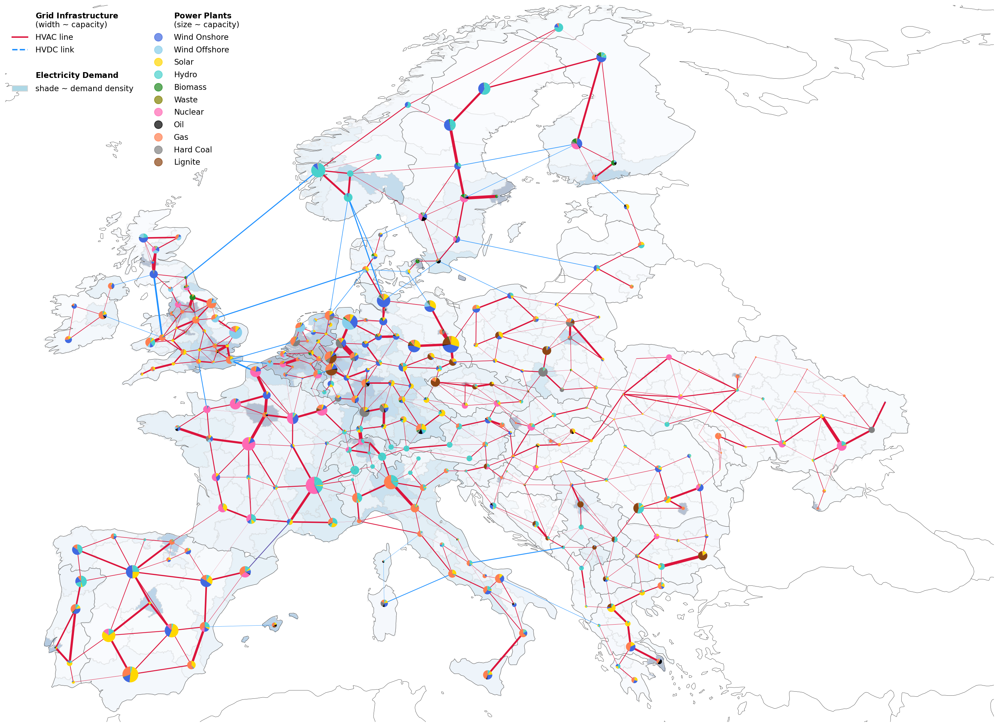
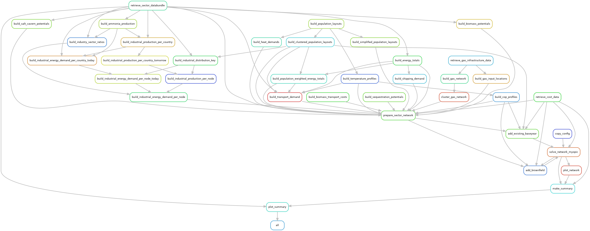

..
  SPDX-FileCopyrightText: 2019-2023 The PyPSA-Eur Authors

  SPDX-License-Identifier: CC-BY-4.0

##################################################################################
PyPSA-Eur: A Sector-Coupled Open Optimisation Model of the European Energy System
##################################################################################

.. image:: https://img.shields.io/github/v/release/pypsa/pypsa-eur?include_prereleases
    :alt: GitHub release (latest by date including pre-releases)

.. image:: https://github.com/pypsa/pypsa-eur/actions/workflows/ci.yaml/badge.svg
    :target: https://github.com/PyPSA/pypsa-eur/actions

.. image:: https://readthedocs.org/projects/pypsa-eur/badge/?version=latest
    :target: https://pypsa-eur.readthedocs.io/en/latest/?badge=latest
    :alt: Documentation

.. image:: https://img.shields.io/github/repo-size/pypsa/pypsa-eur
    :alt: GitHub repo size

.. image:: https://zenodo.org/badge/DOI/10.5281/zenodo.3520874.svg
    :target: https://doi.org/10.5281/zenodo.3520874

.. image:: https://img.shields.io/badge/snakemake-≥7.19-brightgreen.svg?style=flat
    :target: https://snakemake.readthedocs.io
    :alt: Snakemake

.. image:: https://api.reuse.software/badge/github.com/pypsa/pypsa-eur
    :target: https://api.reuse.software/info/github.com/pypsa/pypsa-eur
    :alt: REUSE

.. image:: https://img.shields.io/stackexchange/stackoverflow/t/pypsa
   :target: https://stackoverflow.com/questions/tagged/pypsa
   :alt: Stackoverflow

PyPSA-Eur is an open model dataset of the European energy system at the
transmission network level that covers the full ENTSO-E area. It covers demand
and supply for all energy sectors. From version v0.8.0, PyPSA-Eur includes all
the features from PyPSA-Eur-Sec, which is now deprecated.

Electricity System
==================

The electricity system representation contains alternating current lines at
and above 220 kV voltage level and all high voltage direct current lines,
substations, an open database of conventional power plants, time series for
electrical demand and variable renewable generator availability, geographic
potentials for the expansion of wind and solar power.

The model is suitable both for operational studies and generation and
transmission expansion planning studies. The continental scope and highly
resolved spatial scale enables a proper description of the long-range smoothing
effects for renewable power generation and their varying resource availability.

|

Sector-Coupled Energy System
============================

A sector-coupled extension (previously known as **PyPSA-Eur-Sec**, which is now
deprecated) adds demand and supply for the following sectors: transport, space
and water heating, biomass, energy consumption in the agriculture, industry and
industrial feedstocks, carbon management, carbon capture and
usage/sequestration. This completes the energy system and includes all
greenhouse gas emitters except waste management, agriculture, forestry and land
use. The diagram below gives an overview of the sectors and the links between
them:

.. image:: ../graphics/multisector_figure.png
    :width: 70%
    :align: center

.. note::
    You can find showcases of the model's capabilities in the Supplementary Materials of the
    Joule paper `The potential role of a hydrogen network in Europe
    <https://doi.org/10.1016/j.joule.2023.06.016>`_, the Supplementary Materials of another `paper in Joule with a
    description of the industry sector
    <https://doi.org/10.1016/j.joule.2022.04.016>`_, or in `a 2021 presentation
    at EMP-E <https://nworbmot.org/energy/brown-empe.pdf>`_.
    The sector-coupled extension of PyPSA-Eur was
    initially described in the paper `Synergies of sector coupling and transmission
    reinforcement in a cost-optimised, highly renewable European energy system
    <https://arxiv.org/abs/1801.05290>`_ (2018) but it differs by being based on the
    higher resolution electricity transmission model `PyPSA-Eur
    <https://github.com/PyPSA/pypsa-eur>`_ rather than a one-node-per-country model,
    and by including biomass, industry, industrial feedstocks, aviation, shipping,
    better carbon management, carbon capture and usage/sequestration, and gas
    networks.

About
=====

PyPSA-Eur is designed to be imported into the open energy system modelling
framework `PyPSA <https://www.pypsa.org>`_ for which `documentation
<https://pypsa.readthedocs.io>`_ is available as well. However, since the
workflow is modular, it should be easy to adapt the data workflow to other
modelling frameworks.

The restriction to freely available and open data encourages the open exchange
of model data developments and eases the comparison of model results. It
provides a full, automated software pipeline to assemble the load-flow-ready
model from the original datasets, which enables easy replacement and improvement
of the individual parts.

.. warning::
    PyPSA-Eur is under active development and has several
    :doc:`limitations` which
    you should understand before using the model. The Github repository
    `issues <https://github.com/PyPSA/pypsa-eur/issues>`_ collect known
    topics we are working on. Please feel free to help or make suggestions.

This project is currently maintained by the `Department of Digital
Transformation in Energy Systems <https:/www.ensys.tu-berlin.de>`_ at the
`Technische Universität Berlin <https://www.tu.berlin>`_. Previous versions were
developed within the `IAI <http://www.iai.kit.edu>`_ at the `Karlsruhe Institute
of Technology (KIT) <http://www.kit.edu/english/index.php>`_ which was funded by
the `Helmholtz Association <https://www.helmholtz.de/en/>`_, and by the
`Renewable Energy Group
<https://fias.uni-frankfurt.de/physics/schramm/renewable-energy-system-and-network-analysis/>`_
at `FIAS <https://fias.uni-frankfurt.de/>`_ to carry out simulations for the
`CoNDyNet project <http://condynet.de/>`_, financed by the `German Federal
Ministry for Education and Research (BMBF) <https://www.bmbf.de/en/index.html>`_
as part of the `Stromnetze Research Initiative
<http://forschung-stromnetze.info/projekte/grundlagen-und-konzepte-fuer-effiziente-dezentrale-stromnetze/>`_.

Workflow
========

.. note::
    The graph above was generated using
    ``snakemake --rulegraph -F | sed -n "/digraph/,/}/p" | dot -Tpng -o workflow.png``

Learning Energy System Modelling
================================

If you are (relatively) new to energy system modelling and optimisation and plan
to use PyPSA-Eur, the following resources are one way to get started in addition
to reading this documentation.

- Documentation of `PyPSA <https://pypsa.readthedocs.io>`__, the package for
  modelling energy systems which PyPSA-Eur uses under the hood.
- Course on `Energy Systems <https://nworbmot.org/courses/es-22/>`_ given at
  Technical University of Berlin by `Prof. Dr. Tom Brown <https://nworbmot.org>`_.
- Course on `Data Science for Energy System Modelling <https://fneum.github.io/data-science-for-esm/intro.html>`_
  given at Technical University of Berlin by `Dr. Fabian Neumann <https://neumann.fyi>`_.

Citing PyPSA-Eur
================

If you use PyPSA-Eur for your research, we would appreciate it if you would cite one of the following papers:

For electricity-only studies: ::

    @article{PyPSAEur,
        author = "Jonas Hoersch and Fabian Hofmann and David Schlachtberger and Tom Brown",
        title = "PyPSA-Eur: An open optimisation model of the European transmission system",
        journal = "Energy Strategy Reviews",
        volume = "22",
        pages = "207--215",
        year = "2018",
        doi = "10.1016/j.esr.2018.08.012",
        eprint = "1806.01613"
    }

For sector-coupling studies: ::

    @misc{PyPSAEurSec,
        author = "Fabian Neumann and Elisabeth Zeyen and Marta Victoria and Tom Brown",
        title = "The potential role of a hydrogen network in Europe",
        journal "Joule",
        volume = "7",
        pages = "1--25"
        year = "2023",
        eprint = "2207.05816",
        doi = "10.1016/j.joule.2023.06.016",
    }

For sector-coupling studies with pathway optimisation: ::

    @article{SpeedTechnological2022,
        title = "Speed of technological transformations required in {Europe} to achieve different climate goals",
        author = "Marta Victoria and Elisabeth Zeyen and Tom Brown",
        journal = "Joule",
        volume = "6",
        number = "5",
        pages = "1066--1086",
        year = "2022",
        doi = "10.1016/j.joule.2022.04.016",
        eprint = "2109.09563",
    }

If you want to cite a specific PyPSA-Eur version, each release of PyPSA-Eur is stored on Zenodo with a release-specific DOI:

.. image:: https://zenodo.org/badge/DOI/10.5281/zenodo.3520874.svg
   :target: https://doi.org/10.5281/zenodo.3520874

Pre-Built Networks as a Dataset
===============================

There are pre-built networks available as a dataset on Zenodo as well for every release of PyPSA-Eur.

.. image:: https://zenodo.org/badge/DOI/10.5281/zenodo.3601881.svg
   :target: https://doi.org/10.5281/zenodo.3601881

The included ``.nc`` files are PyPSA network files which can be imported with PyPSA via:

.. code:: python

    import pypsa

    filename = "elec_s_1024_ec.nc"  # example
    n = pypsa.Network(filename)

Operating Systems
=================

The PyPSA-Eur workflow is continuously tested for Linux, macOS and Windows (WSL only).

.. toctree::
   :hidden:
   :maxdepth: 1
   :caption: Getting Started

   introduction
   installation
   tutorial
   tutorial_sector

.. toctree::
   :hidden:
   :maxdepth: 1
   :caption: Configuration

   wildcards
   configuration
   foresight
   costs

.. toctree::
   :hidden:
   :maxdepth: 1
   :caption: Rules Overview

   retrieve
   preparation
   simplification
   sector
   solving
   plotting

.. toctree::
   :hidden:
   :maxdepth: 1
   :caption: Implementation details for sector-coupled systems

   spatial_resolution
   supply_demand

.. toctree::
   :hidden:
   :maxdepth: 1
   :caption: References

   release_notes
   licenses
   validation
   limitations
   contributing
   support
   publications
