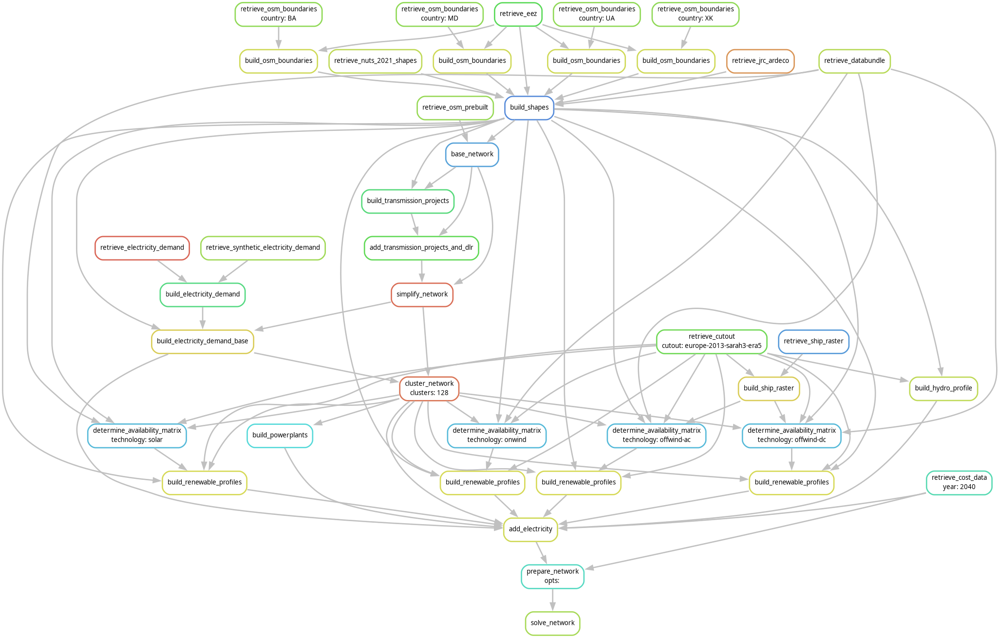

..
  SPDX-FileCopyrightText: 2019-2024 The PyPSA-Eur Authors

  SPDX-License-Identifier: CC-BY-4.0

.. _intro:

##########################################
 Introduction
##########################################

.. raw:: html

    <iframe width="832" height="468" src="https://www.youtube.com/embed/ty47YU1_eeQ" frameborder="0" allow="accelerometer; autoplay; encrypted-media; gyroscope; picture-in-picture" allowfullscreen></iframe>

.. note::
    Find the introductory slides `here <https://docs.google.com/presentation/d/e/2PACX-1vQGQZD7KIVdocRZzRVu8Uk-JC_ltEow5zjtIarhyws46IMJpaqGuux695yincmJA_i5bVEibEs7z2eo/pub?start=false&loop=true&delayms=3000>`__.

.. warning::
    The video only introduces the electricity-only part of PyPSA-Eur.

Workflow
=========

The generation of the model is controlled by the open workflow management system
`Snakemake <https://snakemake.github.io/>`__. In a nutshell, the ``Snakefile``
declares for each script in the ``scripts`` directory a rule which describes
which files the scripts consume and produce (their corresponding input and
output files). The ``snakemake`` tool then runs the scripts in the correct order
according to the rules' input and output dependencies. Moreover, ``snakemake``
will track what parts of the workflow have to be regenerated when files or
scripts were modified.

For instance, an invocation to

.. code:: console

    $ snakemake results/networks/base_s_128_elec_lvopt_.nc

follows this dependency graph

to solve an electricity system model.

The **blocks** represent the individual rules which are required to create the
file referenced in the command above. The **arrows** indicate the outputs from
preceding rules which another rule takes as input data.

.. note::
    The dependency graph was generated using
    ``snakemake --dag results/networks/base_s_128_elec_lvopt_.nc -F | sed -n "/digraph/,/}/p" | dot -Tpng -o doc/img/intro-workflow.png``

For the use of ``snakemake``, it makes sense to familiarize yourself quickly
with the `basic tutorial
<https://snakemake.readthedocs.io/en/stable/tutorial/basics.html>`__ and then
read carefully through the documentation of the `command line interface
<https://snakemake.readthedocs.io/en/stable/executing/cli.html>`__, noting the
arguments ``-j``, ``-c``, ``-f``, ``-F``, ``-n``, ``-r``, ``--dag`` and ``-t``
in particular.

Scenarios, Configuration and Modification
=========================================

It is easy to run PyPSA-Eur for multiple scenarios using the `wildcards feature
<https://snakemake.readthedocs.io/en/stable/snakefiles/rules.html#wildcards>`__
of ``snakemake``. Wildcards allow to generalise a rule to produce all files that
follow a `regular expression
<https://en.wikipedia.org/wiki/Regular_expression>`__ pattern, which defines
a particular scenario. One can think of a wildcard as a parameter that shows
up in the input/output file names and thereby determines which rules to run,
what data to retrieve and what files to produce. Details are explained in
:ref:`wildcards` and :ref:`scenario`.

The model also has several further configuration options collected in the
``config/config.default.yaml`` file located in the root directory, which that are not part of
the scenarios. Options are explained in :ref:`config`.

Folder Structure
================

- ``scripts``: Includes all the Python scripts executed by the ``snakemake`` rules.
- ``rules``: Includes all the ``snakemake`` rules loaded in the ``Snakefile``.
- ``envs``: Includes all the ``conda`` environment specifications to run the workflow.
- ``data``: Includes input data that is not produced by any ``snakemake`` rule.
- ``cutouts``: Stores raw weather data cutouts from ``atlite``.
- ``resources``: Stores intermediate results of the workflow which can be picked up again by subsequent rules.
- ``results``: Stores the solved PyPSA network data, summary files and plots.
- ``logs``: Stores log files.
- ``benchmarks``: Stores ``snakemake`` benchmarks.
- ``doc``: Includes the documentation of PyPSA-Eur.
- ``graphics``: Includes some graphics for the documentation of PyPSA-Eur.

System Requirements
===================

Building the model with the scripts in this repository runs on a regular computer.
But optimising for investment and operation decisions across many scenarios requires a strong interior-point solver
like `Gurobi <http://www.gurobi.com/>`__ or `CPLEX <https://www.ibm.com/analytics/cplex-optimizer>`__ with more memory.
Open-source solvers like `HiGHS <https://highs.dev>` can also be used for smaller problems.
