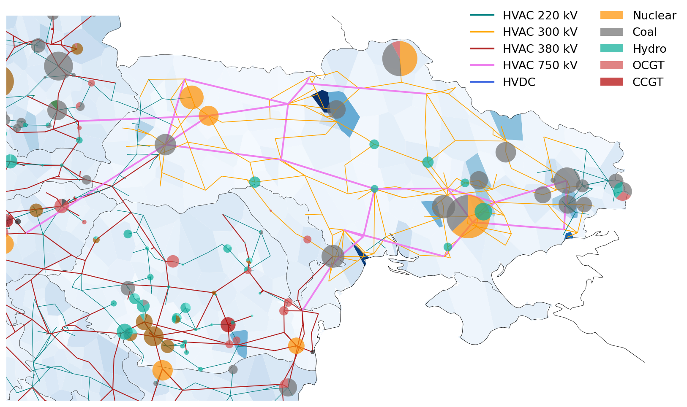

..
  SPDX-FileCopyrightText: 2019-2022 The PyPSA-Eur Authors

  SPDX-License-Identifier: CC-BY-4.0

##########################################
Release Notes
##########################################

Upcoming Release
================

* new feature

PyPSA-Eur 0.6.0 (10th September 2022)
=====================================

* Functionality to consider shipping routes when calculating the available area
  for offshore technologies were added. Data for the shipping density comes from
  the `Global Shipping Traffic Density dataset
  <https://datacatalog.worldbank.org/search/dataset/0037580/Global-Shipping-Traffic-Density>`_.

* When transforming all transmission lines to a unified voltage level of 380kV,
  the workflow now preserves the transmission capacity rather than electrical
  impedance and reactance. 

* Memory resources are now specified for all rules.

* Filtering of power plant data was adjusted to new versions of
  ``powerplantmatching``.

* The resolution of land exclusion calculation is now a configurable option. See
  setting ``excluder_resolution``.

* The software now supports running the workflow with different settings within the same directory. A new config section ``run`` was created that specifies under which scenario ``name`` the created resources, networks and results should be stored. If ``name`` is not specified, the workflow uses the default paths. The entry ``shared_cutouts`` specifies whether the run should use cutouts from the default root directory or use run-specific cutouts.

PyPSA-Eur 0.5.0 (27th July 2022)
=====================================

**New Features**

* New network topology extracted from the ENTSO-E interactive map.

* Added existing renewable capacities for all countries based on IRENA
  statistics (IRENASTAT) using new ``powerplantmatching`` version: 
  * The corresponding ``config`` entries changed, cf. ``config.default.yaml``:	
    * old: ``estimate_renewable_capacities_from_capacity_stats``	
    * new: ``estimate_renewable_capacities``	
  * The estimation is endabled by setting the subkey ``enable`` to ``True``.	
  * Configuration of reference year for capacities can be configured (default:
    ``2020``) 	
  * The list of renewables provided by the OPSD database can be used as a basis,
    using the tag ``from_opsd: True``. This adds the renewables from the
    database and fills up the missing capacities with the heuristic
    distribution. 	
  * Uniform expansion limit of renewable build-up based on existing capacities
    can be configured using ``expansion_limit`` option (default: ``false``;
    limited to determined renewable potentials)	
  * Distribution of country-level capacities proportional to maximum annual
    energy yield for each bus region	
  * The config key ``renewable_capacities_from_OPSD`` is deprecated and was moved
    under the section, ``estimate_renewable_capacities``. To enable it, set
    ``from_opsd`` to ``True``.	

* Add operational reserve margin constraint analogous to `GenX implementation
  <https://genxproject.github.io/GenX/dev/core/#Reserves>`_. Can be activated
  with config setting ``electricity: operational_reserve:``.	

* Implement country-specific  Energy Availability Factors (EAFs) for nuclear
  power plants based on IAEA 2018-2020 reported country averages. These are
  specified ``data/nuclear_p_max_pu.csv`` and translate to static ``p_max_pu``
  values.

* Add function to add global constraint on use of gas in :mod:`prepare_network`.
  This can be activated by including the keyword ``CH4L`` in the ``{opts}``
  wildcard which enforces the limit set in ``electricity: gaslimit:`` given in
  MWh thermal. Alternatively, it is possible to append a number in the ``{opts}``
  wildcard, e.g. ``CH4L200`` which limits the gas use to 200 TWh thermal.

* Add option to alter marginal costs of a carrier through ``{opts}`` wildcard:
  ``<carrier>+m<factor>``, e.g. ``gas+m2.5``, will multiply the default marginal
  cost for gas by factor 2.5.

* Hierarchical clustering was introduced. Distance metric is calculated from
  renewable potentials on hourly (feature entry ends with ``-time``) or annual
  (feature entry in config end with ``-cap``) values.
  
* Greedy modularity clustering was introduced. Distance metric is based on electrical distance taking into account the impedance of all transmission lines of the network.

* Techno-economic parameters of technologies (e.g. costs and efficiencies) will
  now be retrieved from a separate repository `PyPSA/technology-data
  <https://github.com/pypsa/technology-data>`_ that collects assumptions from a
  variety of sources. It is activated by default with ``enable:
  retrieve_cost_data: true`` and controlled with ``costs: year:`` and ``costs:
  version:``. The location of this data changed from ``data/costs.csv`` to
  ``resources/costs.csv`` [`#184
  <https://github.com/PyPSA/pypsa-eur/pull/184>`_].

* A new section ``conventional`` was added to the config file. This section
  contains configurations for conventional carriers.  

* Add configuration option to implement arbitrary generator attributes for
  conventional generation technologies.

* Add option to set CO2 emission prices through ``{opts}`` wildcard: ``Ep<number>``,
  e.g. ``Ep180``, will set the EUR/tCO2 price.

**Changes**

* Add an efficiency factor of 88.55% to offshore wind capacity factors as a
  proxy for wake losses. More rigorous modelling is `planned
  <https://github.com/PyPSA/pypsa-eur/issues/153>`_ [`#277
  <https://github.com/PyPSA/pypsa-eur/pull/277>`_].

* Following discussion in `#285
  <https://github.com/PyPSA/pypsa-eur/issues/285>`_ we have disabled the
  correction factor for solar PV capacity factors by default while satellite
  data is used. A correction factor of 0.854337 is recommended if reanalysis
  data like ERA5 is used.

* The default deployment density of AC- and DC-connected offshore wind capacity
  is reduced from 3 MW/sqkm to a more conservative estimate of 2 MW/sqkm [`#280
  <https://github.com/PyPSA/pypsa-eur/pull/280>`_].

* The inclusion of renewable carriers is now specified in the config entry
  ``renewable_carriers``. Before this was done by commenting/uncommenting
  sub-sections in the ``renewable`` config section. 

* Now, all carriers that should be extendable have to be listed in the config
  entry ``extendable_carriers``. Before, renewable carriers were always set to
  be extendable. For backwards compatibility, the workflow is still looking at
  the listed carriers under the ``renewable`` key. In the future, all of them
  have to be listed under ``extendable_carriers``. 	

* It is now possible to set conventional power plants as extendable by adding
  them to the list of extendable ``Generator`` carriers in the config.	

* Listing conventional carriers in ``extendable_carriers`` but not in
  ``conventional_carriers``, sets the corresponding conventional power plants as
  extendable without a lower capacity bound of today's capacities.	

* Now, conventional carriers have an assigned capital cost by default.	

* The ``build_year`` and ``lifetime`` column are now defined for conventional
  power plants. 	

* Use updated SARAH-2 and ERA5 cutouts with slightly wider scope to east and
  additional variables.

* Resource definitions for memory usage now follow `Snakemake standard resource
  definition
  <https://snakemake.readthedocs.io/en/stable/snakefiles/rules.html#standard-resources>`_
  ``mem_mb`` rather than ``mem``.

* The powerplants that have been shut down by 2021 are filtered out. 	

* Updated historical `EIA hydro generation data <https://www.eia.gov/international/data/world>`_.

* Network building is made deterministic by supplying a fixed random state to
  network clustering routines.

* Clustering strategies for generator and bus attributes can now be specified directly in the ``config.yaml``.

* Iterative solving with impedance updates is skipped if there are no expandable
  lines.

* The unused argument ``simple_hvdc_costs`` in :mod:`add_electricity` was
  removed.

* Switch from Germany to Belgium for continuous integration and tutorial to save
  resources.

* It is now possible to skip the progressbar for land eligibility calculations for additional speedup.

**Bugs and Compatibility**

* Fix crs bug. Change crs 4236 to 4326.

* ``powerplantmatching>=0.5.1`` is now required for ``IRENASTATS``.	

* Update rasterio version to correctly calculate exclusion raster.

* It is now possible to run the workflow with only landlocked countries.

* Bugfixes for manual load adjustments across years.

* Enable parallel computing with new dask version.

* Restore compatibility of ``mock_snakemake`` with lastest Snakemake versions.

* Script ``build_bus_regions``: move voronoi partition from vresutils to script.

* Script ``add_electricity``: remove ``vresutils.costdata.annuity`` dependency.

* Fix the plot_network snakemake rule.

* Compatibility with pandas 1.4. Address deprecations.

* Restore Windows compatibility by using ``shutil.move`` rather than ``mv``.

Synchronisation Release - Ukraine and Moldova (17th March 2022)
===============================================================

On March 16, 2022, the transmission networks of Ukraine and Moldova have
successfully been `synchronised with the continental European grid <https://www.entsoe.eu/news/2022/03/16/continental-europe-successful-synchronisation-with-ukraine-and-moldova-power-systems/>`_. We have taken
this as an opportunity to add the power systems of Ukraine and Moldova to
PyPSA-Eur. This includes:

* the transmission network topology from the `ENTSO-E interactive map <https://www.entsoe.eu/data/map/>`_.

* existing power plants (incl. nuclear, coal, gas and hydro) from the `powerplantmatching <https://github.com/fresna/powerplantmatching>`_ tool

* country-level load time series from ENTSO-E through the `OPSD platform <https://data.open-power-system-data.org/time_series/2020-10-06>`_, which are then distributed heuristically to substations by GDP and population density.

* wind and solar profiles based on ERA5 and SARAH-2 weather data

* hydro profiles based on historical `EIA generation data <https://www.eia.gov/international/data/world>`_

* a simplified calculation of wind and solar potentials based on the `Copernicus Land Cover dataset <https://land.copernicus.eu/global/products/lc>`_.

* electrical characteristics of 750 kV transmission lines

The Crimean power system is currently disconnected from the main Ukrainian grid and, hence, not included.

This release is not on the ``master`` branch. It can be used with

.. code-block:: bash

  git clone https://github.com/pypsa/pypsa-eur
  git checkout synchronisation-release

PyPSA-Eur 0.4.0 (22th September 2021)
=====================================

**New Features and Changes**

* With this release, we change the license from copyleft GPLv3 to the more
  liberal MIT license with the consent of all contributors
  [`#276 <https://github.com/PyPSA/pypsa-eur/pull/276>`_].

* Switch to the new major ``atlite`` release v0.2.  The version upgrade comes
  along with significant speed up for the rule ``build_renewable_profiles.py``
  (~factor 2). A lot of the code which calculated the land-use availability is now
  outsourced and does not rely on ``glaes``, ``geokit`` anymore. This facilitates
  the environment building and version compatibility of ``gdal``, ``libgdal`` with
  other packages [`#224 <https://github.com/PyPSA/pypsa-eur/pull/224>`_]. 

* Implemented changes to ``n.snapshot_weightings`` in new PyPSA version v0.18
  (cf. `PyPSA/PyPSA/#227 <https://github.com/PyPSA/PyPSA/pull/227>`_)
  [`#259 <https://github.com/PyPSA/pypsa-eur/pull/259>`_].

* Add option to pre-aggregate nodes without power injections (positive or
  negative, i.e. generation or demand) to electrically closest nodes or neighbors
  in ``simplify_network``. Defaults to ``False``. This affects nodes that are no
  substations or have no offshore connection.

* In :mod:`simplify_network`, bus columns with no longer correct entries are
  removed (symbol, tags, under_construction, substation_lv, substation_off)
  [`#219 <https://github.com/PyPSA/pypsa-eur/pull/219>`_]

* Add option to include marginal costs of links representing fuel cells,
  electrolysis, and battery inverters
  [`#232 <https://github.com/PyPSA/pypsa-eur/pull/232>`_].

* The rule and script ``build_country_flh`` are removed as they are no longer
  used or maintained.

* The connection cost of generators in :mod:`simplify_network` are now reported
  in ``resources/connection_costs_s{simpl}.csv`` 
  [`#261 <https://github.com/PyPSA/pypsa-eur/pull/261>`_].

* The tutorial cutout was renamed from ``cutouts/europe-2013-era5.nc`` to
  ``cutouts/be-03-2013-era5.nc`` to accomodate tutorial and productive
  cutouts side-by-side.

* The flag ``keep_all_available_areas`` in the configuration for renewable
  potentials was deprecated and now defaults to ``True``. 

* Update dependencies in ``envs/environment.yaml`` 
  [`#257 <https://github.com/PyPSA/pypsa-eur/pull/257>`_]

* Continuous integration testing switches to Github Actions from Travis CI
  [`#252 <https://github.com/PyPSA/pypsa-eur/pull/252>`_].

* Documentation on readthedocs.io is now built with ``pip`` only and no longer
  requires ``conda`` [`#267 <https://github.com/PyPSA/pypsa-eur/pull/267>`_].

* Use ``Citation.cff`` [`#273 <https://github.com/PyPSA/pypsa-eur/pull/273>`_].

**Bugs and Compatibility**

* Support for PyPSA v0.18 [`#268 <https://github.com/PyPSA/pypsa-eur/pull/268>`_].

* Minimum Python version set to ``3.8``.

* Removed ``six`` dependency [`#245 <https://github.com/PyPSA/pypsa-eur/pull/245>`_].

* Update :mod:`plot_network` and :mod:`make_summary` rules to latest PyPSA
  versions  [`#270 <https://github.com/PyPSA/pypsa-eur/pull/270>`_].

* Keep converter links to store components when using the ``ATK``
  wildcard and only remove DC links [`#214 <https://github.com/PyPSA/pypsa-eur/pull/214>`_].

* Value for ``co2base`` in ``config.yaml`` adjusted to 1.487e9 t CO2-eq
  (from 3.1e9 t CO2-eq). The new value represents emissions related to the
  electricity sector for EU+UK+Balkan. The old value was too high and used when
  the emissions wildcard in ``{opts}`` was used 
  [`#233 <https://github.com/PyPSA/pypsa-eur/pull/233>`_].

* Add escape in :mod:`base_network` if all TYNDP links are already
  contained in the network
  [`#246 <https://github.com/PyPSA/pypsa-eur/pull/246>`_].

* In :mod:`solve_operations_network` the optimised capacities are now
  fixed for all extendable links, not only HVDC links 
  [`#244 <https://github.com/PyPSA/pypsa-eur/pull/244>`_].

* The ``focus_weights`` are now also considered when pre-clustering in
  the :mod:`simplify_network` rule 
  [`#241 <https://github.com/PyPSA/pypsa-eur/pull/241>`_].

* in :mod:`build_renewable_profile` where offshore wind profiles could
  no longer be created [`#249 <https://github.com/PyPSA/pypsa-eur/pull/249>`_].

* Lower expansion limit of extendable carriers is now set to the
  existing capacity, i.e. ``p_nom_min = p_nom`` (0 before). Simultaneously, the
  upper limit (``p_nom_max``) is now the maximum of the installed capacity
  (``p_nom``) and the previous estimate based on land availability (``p_nom_max``)
  [`#260 <https://github.com/PyPSA/pypsa-eur/pull/260>`_].

* Solving an operations network now includes optimized store capacities
  as well. Before only lines, links, generators and storage units were considered
  [`#269 <https://github.com/PyPSA/pypsa-eur/pull/269>`_].

* With ``load_shedding: true`` in the solving options of ``config.yaml``
  load shedding generators are only added at the AC buses, excluding buses for H2
  and battery stores [`#269 <https://github.com/PyPSA/pypsa-eur/pull/269>`_].

* Delete duplicated capital costs at battery discharge link 
  [`#240 <https://github.com/PyPSA/pypsa-eur/pull/240>`_].

* Propagate the solver log file name to the solver. Previously, the
  PyPSA network solving functions were not told about the solver logfile specified
  in the Snakemake file [`#247 <https://github.com/PyPSA/pypsa-eur/pull/247>`_]

PyPSA-Eur 0.3.0 (7th December 2020)
===================================

**New Features**

Using the ``{opts}`` wildcard for scenarios:

* An option is introduced which adds constraints such that each country or node produces on average a minimal share of its total consumption itself.
  For example ``EQ0.5c`` set in the ``{opts}`` wildcard requires each country to produce on average at least 50% of its consumption. Additionally,
  the option ``ATK`` requires autarky at each node and removes all means of power transmission through lines and links. ``ATKc`` only removes
  cross-border transfer capacities. 
  [`#166 <https://github.com/PyPSA/pypsa-eur/pull/166>`_].

* Added an option to alter the capital cost (``c``) or installable potentials (``p``) of carriers by a factor via ``carrier+{c,p}factor`` in the ``{opts}`` wildcard.
  This can be useful for exploring uncertain cost parameters.
  Example: ``solar+c0.5`` reduces the capital cost of solar to 50% of original values
  [`#167 <https://github.com/PyPSA/pypsa-eur/pull/167>`_, `#207 <https://github.com/PyPSA/pypsa-eur/pull/207>`_].

* Added an option to the ``{opts}`` wildcard that applies a time series segmentation algorithm based on renewables, hydro inflow and load time series
  to produce a given total number of adjacent snapshots of varying lengths.
  This feature is an alternative to downsampling the temporal resolution by simply averaging and
  uses the `tsam <https://tsam.readthedocs.io/en/latest/index.html>`_ package
  [`#186 <https://github.com/PyPSA/pypsa-eur/pull/186>`_].

More OPSD integration:

* Add renewable power plants from `OPSD <https://data.open-power-system-data.org/renewable_power_plants/2020-08-25>`_ to the network for specified technologies.
  This will overwrite the capacities calculated from the heuristic approach in :func:`estimate_renewable_capacities()`
  [`#212 <https://github.com/PyPSA/pypsa-eur/pull/212>`_].

* Electricity consumption data is now retrieved directly from the `OPSD website <https://data.open-power-system-data.org/time_series/2019-06-05>`_ using the rule :mod:`build_load_data`.
  The user can decide whether to take the ENTSO-E power statistics data (default) or the ENTSO-E transparency data
  [`#211 <https://github.com/PyPSA/pypsa-eur/pull/211>`_].

Other:

* Added an option to use custom busmaps in rule :mod:`cluster_network`. To use this feature set ``enable: custom_busmap: true``.
  Then, the rule looks for custom busmaps at ``data/custom_busmap_elec_s{simpl}_{clusters}.csv``,
  which should have the same format as ``resources/busmap_elec_s{simpl}_{clusters}.csv``.
  i.e. the index should contain the buses of ``networks/elec_s{simpl}.nc``
  [`#193 <https://github.com/PyPSA/pypsa-eur/pull/193>`_].

* Line and link capacities can be capped in the ``config.yaml`` at ``lines: s_nom_max:`` and ``links: p_nom_max``:
  [`#166 <https://github.com/PyPSA/pypsa-eur/pull/166>`_].

* Added Google Cloud Platform tutorial (for Windows users)
  [`#177 <https://github.com/PyPSA/pypsa-eur/pull/177>`_].

**Changes**

* Don't remove capital costs from lines and links, when imposing a line volume limit (``lv``) or a line cost limit (``lc``).
  Previously, these were removed to move the expansion in direction of the limit
  [`#183 <https://github.com/PyPSA/pypsa-eur/pull/183>`_].

* The mappings for clustered lines and buses produced by the :mod:`simplify_network` and :mod:`cluster_network` rules
  changed from Hierarchical Data Format (``.h5``) to Comma-Separated Values format (``.csv``) for ease of use.
  [`#198 <https://github.com/PyPSA/pypsa-eur/pull/198>`_]

* The N-1 security margin for transmission lines is now fixed to a provided value in ``config.yaml``,
  removing an undocumented linear interpolation between 0.5 and 0.7 in the range between 37 and 200 nodes.
  [`#199 <https://github.com/PyPSA/pypsa-eur/pull/199>`_].

* Modelling hydrogen and battery storage with Store and Link components is now the default,
  rather than using StorageUnit components with fixed power-to-energy ratio
  [`#205 <https://github.com/PyPSA/pypsa-eur/pull/205>`_].

* Use ``mamba`` (https://github.com/mamba-org/mamba) for faster Travis CI builds
  [`#196 <https://github.com/PyPSA/pypsa-eur/pull/196>`_].

* Multiple smaller changes: Removed unused ``{network}`` wildcard, moved environment files to dedicated ``envs`` folder,
  removed sector-coupling components from configuration files, updated documentation colors, minor refactoring and code cleaning
  [`#190 <https://github.com/PyPSA/pypsa-eur/pull 190>`_].

**Bugs and Compatibility**

* Add compatibility for pyomo 5.7.0 in :mod:`cluster_network` and :mod:`simplify_network`
  [`#172 <https://github.com/PyPSA/pypsa-eur/pull/172>`_].

* Fixed a bug for storage units such that individual store and dispatch efficiencies are correctly taken account of rather than only their round-trip efficiencies.
  In the cost database (``data/costs.csv``) the efficiency of battery inverters should be stated as per discharge/charge rather than per roundtrip
  [`#202 <https://github.com/PyPSA/pypsa-eur/pull/202>`_].

* Corrected exogenous emission price setting (in ``config: cost: emission price:``),
  which now correctly accounts for the efficiency and effective emission of the generators
  [`#171 <https://github.com/PyPSA/pypsa-eur/pull/171>`_].

* Corrected HVDC link connections (a) between Norway and Denmark and (b) mainland Italy, Corsica (FR) and Sardinia (IT)
  as well as for East-Western and Anglo-Scottish interconnectors
  [`#181 <https://github.com/PyPSA/pypsa-eur/pull/181>`_, `#206 <https://github.com/PyPSA/pypsa-eur/pull/206>`_].

* Fix bug of clustering ``offwind-{ac,dc}`` generators in the option of high-resolution generators for renewables.
  Now, there are more sites for ``offwind-{ac,dc}`` available than network nodes.
  Before, they were clustered to the resolution of the network (``elec_s1024_37m.nc``: 37 network nodes, 1024 generators)
  [`#191 <https://github.com/PyPSA/pypsa-eur/pull/191>`_].

* Raise a warning if ``tech_colors`` in the config are not defined for all carriers
  [`#178 <https://github.com/PyPSA/pypsa-eur/pull/178>`_]. 

PyPSA-Eur 0.2.0 (8th June 2020)
==================================

* The optimization is now performed using the ``pyomo=False`` setting in the :func:`pypsa.lopf.network_lopf`. This speeds up the solving process significantly and consumes much less memory. The inclusion of additional constraints were adjusted to the new implementation. They are all passed to the :func:`network_lopf` function via the ``extra_functionality`` argument. The rule ``trace_solve_network`` was integrated into the rule :mod:`solve_network` and can be activated via configuration with ``solving: options: track_iterations: true``. The charging and discharging capacities of batteries modelled as store-link combination are now coupled [`#116 <https://github.com/PyPSA/pypsa-eur/pull/116>`_].

* An updated extract of the `ENTSO-E Transmission System Map <https://www.entsoe.eu/data/map/>`_ (including Malta) was added to the repository using the `GridKit <https://github.com/PyPSA/GridKit>`_ tool. This tool has been updated to retrieve up-to-date map extracts using a single `script <https://github.com/PyPSA/GridKit/blob/master/entsoe/runall_in_docker.sh>`_. The update extract features 5322 buses, 6574 lines, 46 links. [`#118 <https://github.com/PyPSA/pypsa-eur/pull/118>`_].

* Added `FSFE REUSE <https://reuse.software>`_ compliant license information. Documentation now licensed under CC-BY-4.0 [`#160 <https://github.com/PyPSA/pypsa-eur/pull/160>`_].

* Added a 30 minute `video introduction <https://pypsa-eur.readthedocs.io/en/latest/introduction.html>`_ and a 20 minute `video tutorial <https://pypsa-eur.readthedocs.io/en/latest/tutorial.html>`_

* Networks now store a color and a nicely formatted name for each carrier, accessible via ``n.carrier['color']`` and ``n.carrier['nice_name'] ``(networks after ``elec.nc``).

* Added an option to skip iterative solving usually performed to update the line impedances of expanded lines at ``solving: options: skip_iterations:``.

* ``snakemake`` rules for retrieving cutouts and the natura raster can now be disabled independently from their respective rules to build them; via ``config.*yaml`` [`#136 <https://github.com/PyPSA/pypsa-eur/pull/136>`_].

* Removed the ``id`` column for custom power plants in ``data/custom_powerplants.csv`` to avoid custom power plants with conflicting ids getting attached to the wrong bus [`#131 <https://github.com/PyPSA/pypsa-eur/pull/131>`_].

* Add option ``renewables: {carrier}: keep_all_available_areas:`` to use all availabe weather cells for renewable profile and potential generation. The default ignores weather cells where only less than 1 MW can be installed  [`#150 <https://github.com/PyPSA/pypsa-eur/pull/150>`_].

* Added a function ``_helpers.load_network()`` which loads a network with overridden components specified in ``snakemake.config['override_components']`` [`#128 <https://github.com/PyPSA/pypsa-eur/pull/128>`_].

* Bugfix in  :mod:`base_network` which now finds all closest links, not only the first entry [`#143 <https://github.com/PyPSA/pypsa-eur/pull/143>`_].

* Bugfix in :mod:`cluster_network` which now skips recalculation of link parameters if there are no links  [`#149 <https://github.com/PyPSA/pypsa-eur/pull/149>`_].

* Added information on pull requests to contribution guidelines [`#151 <https://github.com/PyPSA/pypsa-eur/pull/151>`_].

* Improved documentation on open-source solver setup and added usage warnings.

* Updated ``conda`` environment regarding ``pypsa``, ``pyproj``, ``gurobi``, ``lxml``. This release requires PyPSA v0.17.0.

PyPSA-Eur 0.1.0 (9th January 2020)
==================================

This is the first release of PyPSA-Eur, a model of the European power system at the transmission network level. Recent changes include:

* Documentation on installation, workflows and configuration settings is now available online at `pypsa-eur.readthedocs.io <pypsa-eur.readthedocs.io>`_ [`#65 <https://github.com/PyPSA/pypsa-eur/pull/65>`_].

* The ``conda`` environment files were updated and extended [`#81 <https://github.com/PyPSA/pypsa-eur/pull/81>`_].

* The power plant database was updated with extensive filtering options via ``pandas.query`` functionality [`#84 <https://github.com/PyPSA/pypsa-eur/pull/84>`_ and `#94 <https://github.com/PyPSA/pypsa-eur/pull/94>`_].

* Continuous integration testing with `Travis CI <https://travis-ci.org>`_ is now included for Linux, Mac and Windows [`#82 <https://github.com/PyPSA/pypsa-eur/pull/82>`_].

* Data dependencies were moved to `zenodo <https://zenodo.org/>`_ and are now versioned [`#60 <https://github.com/PyPSA/pypsa-eur/issues/60>`_].

* Data dependencies are now retrieved directly from within the snakemake workflow [`#86 <https://github.com/PyPSA/pypsa-eur/pull/86>`_].

* Emission prices can be added to marginal costs of generators through the keyworks ``Ep`` in the ``{opts}`` wildcard [`#100 <https://github.com/PyPSA/pypsa-eur/pull/100>`_].

* An option is introduced to add extendable nuclear power plants to the network [`#98 <https://github.com/PyPSA/pypsa-eur/pull/98>`_].

* Focus weights can now be specified for particular countries for the network clustering, which allows to set a proportion of the total number of clusters for particular countries [`#87 <https://github.com/PyPSA/pypsa-eur/pull/87>`_].

* A new rule :mod:`add_extra_components` allows to add additional components to the network only after clustering. It is thereby possible to model storage units (e.g. battery and hydrogen) in more detail via a combination of ``Store``, ``Link`` and ``Bus`` elements [`#97 <https://github.com/PyPSA/pypsa-eur/pull/97>`_].

* Hydrogen pipelines (including cost assumptions) can now be added alongside clustered network connections in the rule :mod:`add_extra_components` . Set ``electricity: extendable_carriers: Link: [H2 pipeline]`` and ensure hydrogen storage is modelled as a ``Store``. This is a first simplified stage [`#108 <https://github.com/PyPSA/pypsa-eur/pull/108>`_].

* Logfiles for all rules of the ``snakemake`` workflow are now written in the folder ``log/`` [`#102 <https://github.com/PyPSA/pypsa-eur/pull/102>`_].

* The new function ``_helpers.mock_snakemake`` creates a ``snakemake`` object which mimics the actual ``snakemake`` object produced by workflow by parsing the ``Snakefile`` and setting all paths for inputs, outputs, and logs. This allows running all scripts within a (I)python terminal (or just by calling ``python <script-name>``) and thereby facilitates developing and debugging scripts significantly [`#107 <https://github.com/PyPSA/pypsa-eur/pull/107>`_].

Release Process
===============

* Checkout a new release branch ``git checkout -b release-v0.x.x``.

* Finalise release notes at ``doc/release_notes.rst``.

* Update ``envs/environment.fixed.yaml`` via
  ``conda env export -n pypsa-eur -f envs/environment.fixed.yaml --no-builds``
  from an up-to-date `pypsa-eur` environment.

* Update version number in ``doc/conf.py``, ``CITATION.cff`` and ``*config.*.yaml``.

* Open, review and merge pull request for branch ``release-v0.x.x``.
  Make sure to close issues and PRs or the release milestone with it (e.g. closes #X).

* Tag a release on Github via ``git tag v0.x.x``, ``git push``, ``git push --tags``. Include release notes in the tag message.

* Upload code to `zenodo code repository <https://doi.org/10.5281/zenodo.3520874>`_ with `MIT license <https://opensource.org/licenses/MIT>`_.

* Create pre-built networks for ``config.default.yaml`` by running ``snakemake -j 1 extra_components_all_networks``.

* Upload pre-built networks to `zenodo data repository <https://doi.org/10.5281/zenodo.3601881>`_ with `CC BY 4.0 <https://creativecommons.org/licenses/by/4.0/>`_ license.

* Send announcement on the `PyPSA and PyPSA-Eur mailing list <https://groups.google.com/forum/#!forum/pypsa>`_.
