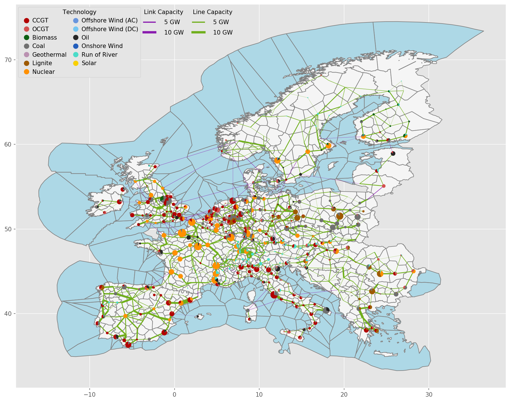
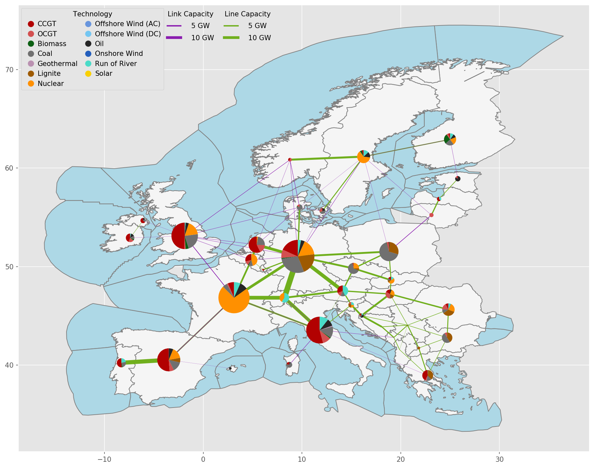

..
  SPDX-FileCopyrightText: Contributors to PyPSA-Eur <https://github.com/pypsa/pypsa-eur>

  SPDX-License-Identifier: CC-BY-4.0

.. _spatial_resolution:

##########################################
Spatial resolution
##########################################

The default nodal resolution of the model follows the electricity generation and transmission model `PyPSA-Eur <https://github.com/PyPSA/pypsa-eur>`__, which clusters down the electricity transmission substations in each European country based on the k-means algorithm (See `cluster_network <https://pypsa-eur.readthedocs.io/en/latest/simplification/cluster_network.html#rule-cluster-network>`__ for a complete explanation). This gives nodes which correspond to major load and generation centres (typically cities).

The total number of nodes for Europe is set in the ``config/config.yaml`` file under ``clusters``. The number of nodes can vary between 37, the number of independent countries / synchronous areas, and several hundred. With 200-300 nodes the model needs 100-150 GB RAM to solve with a commercial solver like Gurobi.

Exemplary unsolved network clustered to 512 nodes:

Exemplary unsolved network clustered to 37 nodes:

The total number of nodes for Europe is set in the ``config/config.yaml`` file under `clusters <https://github.com/PyPSA/pypsa-eur-sec/blob/3daff49c9999ba7ca7534df4e587e1d516044fc3/config.default.yaml#L20>`__.  The number of nodes can vary between 37, the number of independent countries/synchronous areas, and several hundred. With 200-300 nodes, the model needs 100-150 GB RAM to solve with a commercial solver like Gurobi.
Not all of the sectors are at the full nodal resolution, and some demand for some sectors is distributed to nodes using heuristics that need to be corrected. Some networks are copper-plated to reduce computational times.

Here are some examples of how spatial resolution is set for different sectors in PyPSA-Eur-Sec:

•	Electricity network: Modeled as nodal.

•	Electricity residential and commercial demand: Modeled as nodal, distributed in each country based on population and GDP.

•	Electricity distribution network: Not included in the model, but a link per node can be used to represent energy transferred between distribution and transmission levels (explained more in detail below).

•	Residential and commercial building heating demand: Modeled as nodal, distributed in each country based on population.

•	Electricity demand in industry: Modeled as nodal, based on the location of industrial facilities from HotMaps database.

•	Industry demand (heat, chemicals, etc.) : Modeled as nodal, distributed in each country based on locations of industry from HotMaps database.
•	Hydrogen network: Modeled as nodal (if activated in the `config <https://github.com/PyPSA/pypsa-eur-sec/blob/3daff49c9999ba7ca7534df4e587e1d516044fc3/config.default.yaml#L260>`__ file).

•	Methane network: It can be modeled as a single node for Europe or it can be nodally resolved if activated in the `config <https://github.com/PyPSA/pypsa-eur-sec/blob/3daff49c9999ba7ca7534df4e587e1d516044fc3/config.default.yaml#L266>`__. One node can be considered reasonable since future demand is expected to be low and no bottlenecks are expected. Also, the nodally resolved methane grid is based on SciGRID_gas data.

•	Solid biomass: It can be modeled as a single node for Europe or it can be nodally resolved if activated in the `config <https://github.com/PyPSA/pypsa-eur-sec/blob/3daff49c9999ba7ca7534df4e587e1d516044fc3/config.default.yaml#L270>`__. Nodal modeling includes modeling biomass potential per country (given per country, then distributed by population density within) and the transport of solid biomass between countries.

•	CO2: It can be modeled as a single node for Europe or it can be nodally resolved with CO2 transport pipelines if activated in the `config <https://github.com/PyPSA/pypsa-eur-sec/blob/3daff49c9999ba7ca7534df4e587e1d516044fc3/config.default.yaml#L248>`__. It should mentioned that in single node mode a transport and storage cost is added for sequestered CO2, the cost of which can be adjusted in the `config <https://github.com/PyPSA/pypsa-eur-sec/blob/3daff49c9999ba7ca7534df4e587e1d516044fc3/config.default.yaml#L247>`__.

•	Carbonaceous fuels: Modeled as a single node for Europe by default, since transport costs for liquids are low and no bottlenecks are expected. Can be regionally resolved in configuration.

**Electricity distribution network**

Contrary to the transmission grid, the grid topology at the distribution level (at and below 110 kV) is not included due to the very high computational burden. However, a link per node can be used (if activated in the `Config <https://github.com/PyPSA/pypsa-eur-sec/blob/3daff49c9999ba7ca7534df4e587e1d516044fc3/config.default.yaml#L257>`__ file) to represent energy transferred between distribution and transmission levels at every node. In essence, the total energy capacity connecting the transmission grid and the low-voltage level is optimized. The cost assumptions for this link can be adjusted in Config file `options <https://github.com/PyPSA/pypsa-eur-sec/blob/3daff49c9999ba7ca7534df4e587e1d516044fc3/config.default.yaml#L258>`__ , and is currently assumed to be 500 Eur/kW.

Rooftop PV, heat pumps, resistive heater, home batteries chargers for passenger EVs, as well as individual heating technologies (heat pumps and resistive heaters)  are connected to low-voltage level. All the remaining generation and storage technologies are connected to the transmission grid. In practice, this means that the distribution grid capacity is only extended if it is necessary to balance the mismatch between local generation and demand.
