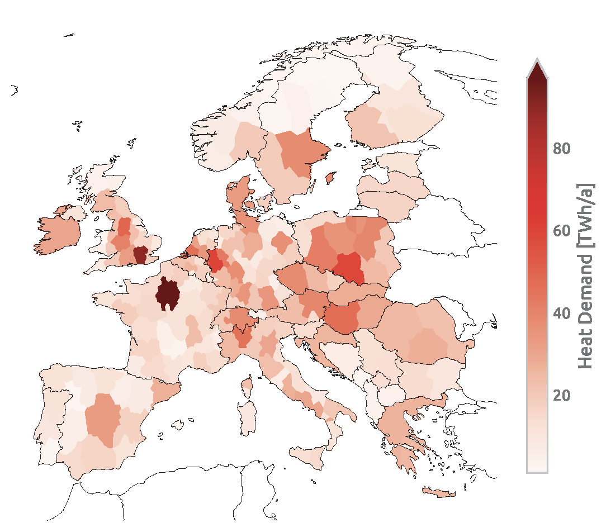
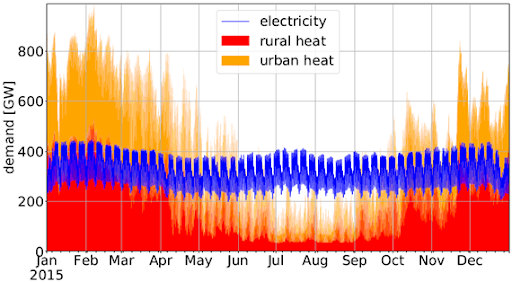
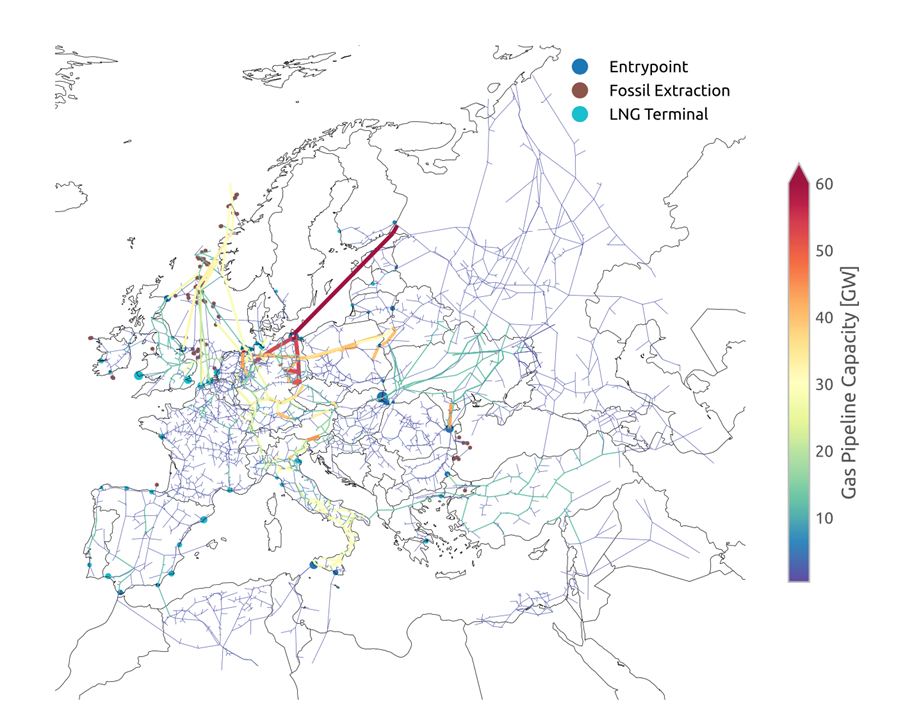
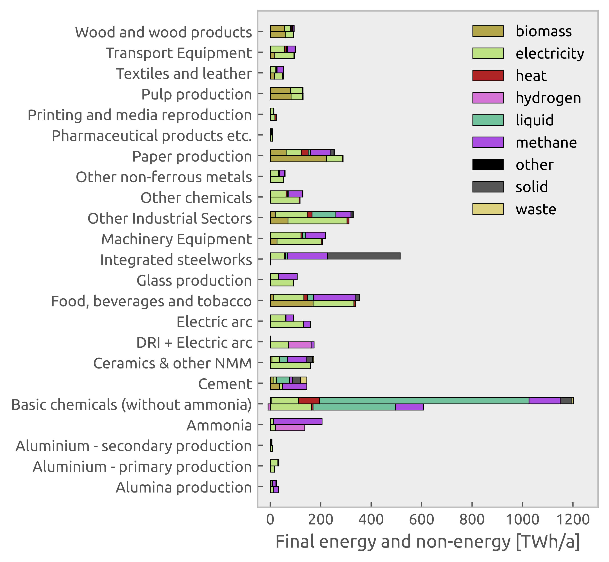
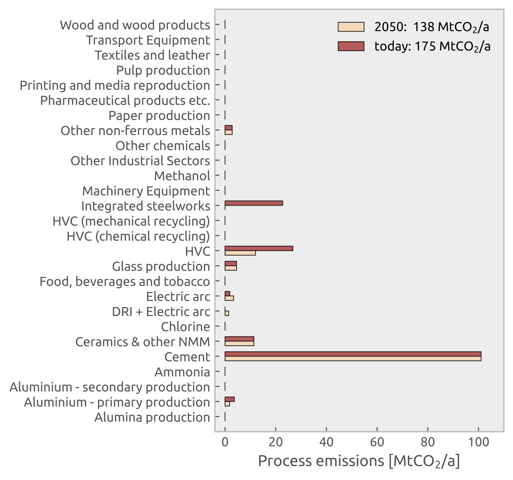
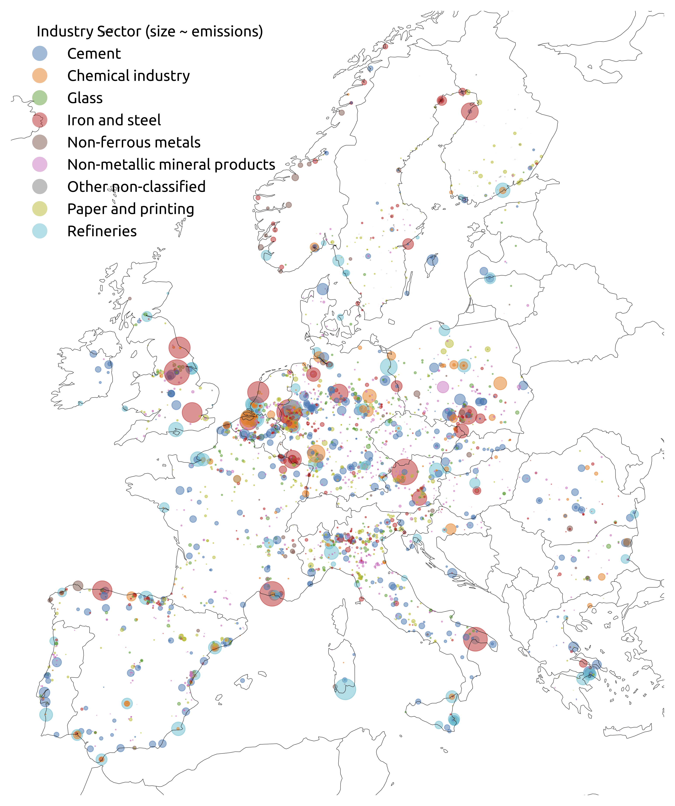

..
  SPDX-FileCopyrightText: 2021-2023 The PyPSA-Eur Authors

  SPDX-License-Identifier: CC-BY-4.0

##########################################
Supply and demand
##########################################

An initial orientation to the supply and demand options in the model
PyPSA-Eur-Sec can be found in the description of the model
PyPSA-Eur-Sec-30 in the paper `Synergies of sector coupling and
transmission reinforcement in a cost-optimised, highly renewable
European energy system <https://arxiv.org/abs/1801.05290>`_ (2018).
The latest version of PyPSA-Eur-Sec differs by including biomass,
industry, industrial feedstocks, aviation, shipping, better carbon
management, carbon capture and usage/sequestration, and gas networks.

The basic supply (left column) and demand (right column) options in the model are described in this figure:

.. image:: ../graphics/multisector_figure.png

.. _Electricity supply and demand:

Electricity supply and demand
=============================

Electricity supply and demand follows the electricity generation and
transmission model `PyPSA-Eur <https://github.com/PyPSA/pypsa-eur>`_,
except that hydrogen storage is integrated into the hydrogen supply,
demand and network, and PyPSA-Eur-Sec includes CHPs.

Unlike PyPSA-Eur, PyPSA-Eur-Sec does not distribution electricity demand for industry according to population and GDP, but uses the
geographical data from the `Hotmaps Industrial Database
<https://gitlab.com/hotmaps/industrial_sites/industrial_sites_Industrial_Database>`_.

Also unlike PyPSA-Eur, PyPSA-Eur-Sec subtracts existing electrified heating from the existing electricity demand, so that power-to-heat can be optimised separately.

The remaining electricity demand for households and services is distributed inside each country proportional to GDP and population.

.. _Heat demand:

Heat demand
===========

Building heating in residential and services sectors is resolved regionally, both for individual buildings and district heating systems, which include different supply options (see :ref:`heat-supply`.)
Annual heat demands per country are retrieved from `JRC-IDEES  <https://op.europa.eu/en/publication-detail/-/publication/989282db-ad65-11e7-837e-01aa75ed71a1/language-en>`_ and split into space and water heating. For space heating, the annual demands are converted to daily values based on the population-weighted Heating Degree Day (HDD) using the `atlite tool <https://github.com/PyPSA/atlite>`_, where space heat demand is proportional to the difference between the daily average ambient temperature (read from `ERA5 <https://doi.org/10.1002/qj.3803>`_) and a threshold temperature above which space heat demand is zero. A threshold temperature of 15 °C is assumed by default. The daily space heat demand is distributed to the hours of the day following heat demand profiles from `BDEW <https://github.com/oemof/demandlib>`_. These differ for weekdays and weekends/holidays and between residential and services demand.

*Space heating*

The space heating demand can be exogenously reduced by retrofitting measures that improve the buildings’ thermal envelopes.

.. literalinclude:: ../config.default.yaml
    :language: yaml
    :lines: 205

Co-optimsing of building renovation is also possible, if it is activated in the `config file <https://github.com/PyPSA/pypsa-eur-sec/blob/3daff49c9999ba7ca7534df4e587e1d516044fc3/config.default.yaml#L222>`_.
Renovation of the thermal envelope reduces the space heating demand and is optimised at each node for every heat bus. Renovation measures through additional insulation material and replacement of energy inefficient windows are considered.
In a first step, costs per energy savings are estimated in `build_retro_cost.py <https://github.com/PyPSA/pypsa-eur-sec/blob/master/scripts/build_retro_cost.py>`_. They depend on the insulation condition of the building stock and costs for renovation of the building elements. In a second step, for those cost per energy savings two possible renovation strengths are determined: a moderate renovation with lower costs, a lower maximum possible space heat savings, and an ambitious renovation with associated higher costs and higher efficiency gains. They are added by step-wise linearisation in form of two additional generations in `prepare_sector_network.py <https://github.com/PyPSA/pypsa-eur-sec/blob/master/scripts/prepare_sector_network.py>`_.
Further information are given in the publication :
 `Mitigating heat demand peaks in buildings in a highly renewable European energy system, (2021)  <https://arxiv.org/abs/2012.01831>`_.

*Water heating*

Hot water demand is assumed to be constant throughout the year.

*Urban and rural heating*

For every country, heat demand is split between low and high population density areas. These country-level totals are then distributed to each region in proportion to their rural and urban populations respectively. Urban areas with dense heat demand can be supplied with large-scale district heating systems. The percentage of urban heat demand that can be supplied by district heating networks as well as lump-sum losses in district heating systems is exogenously determined in the `config file <https://github.com/PyPSA/pypsa-eur-sec/blob/3daff49c9999ba7ca7534df4e587e1d516044fc3/config.default.yaml#L153>`_.

*Cooling demand*

Cooling is electrified and is included in the electricity demand. Cooling demand is assumed to remain at current levels.  An example of regional distribution of the total heat demand for network 181 regions is depicted below.

As below figure shows, the current total heat demand in Europe is similar to the total electricity demand but features much more pronounced seasonal variations. The current total building heating demand in Europe adds up to 3084 TWh/a of which 78% occurs in urban areas.

In practice, in PyPSA-Eur-Sec, there are heat demand buses to which the corresponding heat demands are added.

1)	Urban central heat: large-scale district heating networks in urban areas with dense heat population. Residential and services demand in these areas are added as demands to this bus
2)	Residential urban decentral heat: heating for residential buildings in urban areas not using district heating
3)	Services urban decentral heat: heating for services buildings in urban areas not using district heating
4)	Residential rural heat: heating for residential buildings in rural areas with low population density.
5)	Services rural heat: heating for residential services buildings in rural areas with low population density. Heat demand from agriculture  sector is also included here.

.. _heat-supply:

Heat supply
=======================

Different supply options are available depending on whether demand is met centrally through district heating systems, or decentrally through appliances in individual buildings.

**Urban central heat**

For large-scale district heating systems the following options are available: combined heat and power (CHP) plants consuming gas or biomass from waste and residues with and without carbon capture (CC), large-scale air-sourced heat pumps, gas and oil boilers, resistive heaters, and fuel cell CHPs. Additionally, waste heat from the `Fischer-Tropsch <https://github.com/PyPSA/pypsa-eur-sec/blob/3daff49c9999ba7ca7534df4e587e1d516044fc3/config.default.yaml#L255>`_  and `Sabatier <https://github.com/PyPSA/pypsa-eur-sec/blob/3daff49c9999ba7ca7534df4e587e1d516044fc3/config.default.yaml#L240>`_ processes for the production of synthetic hydrocarbons can supply district heating systems. For more detailed explanation of these processes, see :ref:`Oil-based products supply` and :ref:`Methane supply`.

**Residential and Urban decentral heat**

Supply options in individual buildings include gas and oil boilers, air- and ground-sourced heat pumps, resistive heaters, and solar thermal collectors.
Ground-source heat pumps are only allowed in rural areas because of space constraints. Thus, only air- source heat pumps are allowed in urban areas. This is a conservative assumption, since there are many possible sources of low-temperature heat that could be tapped in cities (e.g. waste water, ground water, or natural bodies of water). Costs, lifetimes and efficiencies for these technologies are retrieved from the `technology-data repository <https://github.com/PyPSA/technology-data>`_.

Below are more detailed explanations for each heating supply component, all of which are modelled as `links <https://pypsa.readthedocs.io/en/latest/components.html?highlight=distribution#link>`_ in PyPSA-Eur-Sec.

.. _Large-scale CHP:

**Large-scale CHP**

Large Combined Heat and Power plants are included in the model if it is specified in the `config file <https://github.com/PyPSA/pypsa-eur-sec/blob/3daff49c9999ba7ca7534df4e587e1d516044fc3/config.default.yaml#L235>`_.

CHPs are based on back pressure plants operating with a fixed ratio of electricity to heat output. The efficiencies of each are given on the back pressure line, where the back pressure coefficient cb is the electricity output divided by the heat output. (For a more complete explanation of the operation of CHPs refer to the study by Dahl et al. : `Cost sensitivity of optimal sector-coupled district heating production systems <https://arxiv.org/pdf/1804.07557.pdf>`_.

PyPSA-Eur-Sec includes CHP plants fueled by methane and solid biomass from waste and residues. Hydrogen fuel cells also produce both electricity and heat.

The methane CHP is modeled on the Danish Energy Agency (DEA) “Gas turbine simple cycle (large)” while the solid biomass CHP is based on the DEA’s “09b Wood Pellets Medium”. For biomass CHP, cb = `0.46 <https://ens.dk/sites/ens.dk/files/Statistik/technology_data_catalogue_for_el_and_dh_-_0009.pdf#page=156>`_ , whereas for gas CHP, cb = `1 <https://ens.dk/sites/ens.dk/files/Statistik/technology_data_catalogue_for_el_and_dh_-_0009.pdf#page=64>`_.

NB: The old PyPSA-Eur-Sec-30 model assumed an extraction plant (like the DEA coal CHP) for gas which has flexible production of heat and electricity within the feasibility diagram of Figure 4 in the study by `Brown et al. <https://arxiv.org/abs/1801.05290>`_ We have switched to the DEA back pressure plants since these are more common for smaller plants for biomass, and because the extraction plants were on the back pressure line for 99.5% of the time anyway. The plants were all changed to back pressure in PyPSA-Eur-Sec v0.4.0.

**Micro-CHP**

PyPSA-Eur-Sec allows individual buildings to make use of `micro gas CHPs <https://github.com/PyPSA/pypsa-eur-sec/blob/3daff49c9999ba7ca7534df4e587e1d516044fc3/config.default.yaml#L236>`_ that are assumed to be installed at the distribution grid level.

**Heat pumps**

The coefficient of performance (COP) of air- and ground-sourced heat pumps depends on the ambient or soil temperature respectively. Hence, the COP is a time-varying parameter (refer to `Config <https://github.com/PyPSA/pypsa-eur-sec/blob/3daff49c9999ba7ca7534df4e587e1d516044fc3/config.default.yaml#L206>`_ file). Generally, the COP will be lower during winter when temperatures are low. Because the ambient temperature is more volatile than the soil temperature, the COP of ground-sourced heat pumps is less variable. Moreover, the COP depends on the difference between the source and sink temperatures:

.. math::
	\Delta T = T_{sink} − T_{source}

For the sink water temperature Tsink we assume 55 °C [`Config <https://github.com/PyPSA/pypsa-eur-sec/blob/3daff49c9999ba7ca7534df4e587e1d516044fc3/config.default.yaml#L207>`_ file]. For the time- and location-dependent source temperatures Tsource, we rely on the `ERA5 <https://doi.org/10.1002/qj.3803>`_ reanalysis weather data. The temperature differences are converted into COP time series using results from a regression analysis performed in the study by `Stafell et al. <https://pubs.rsc.org/en/content/articlelanding/2012/EE/c2ee22653g>`_. For air-sourced heat pumps (ASHP), we use the function:

.. math::
   COP (\Delta T) = 6.81 - 0.121\Delta T + 0.000630\Delta T^2

for ground-sourced heat pumps (GSHP), we use the function:

.. math::
   COP(\Delta T) = 8.77 - 0.150\Delta T + 0.000734\Delta T^2

**Resistive heaters**

Can be activated in Config from the `boilers <https://github.com/PyPSA/pypsa-eur-sec/blob/3daff49c9999ba7ca7534df4e587e1d516044fc3/config.default.yaml#L232>`_ option.
Resistive heaters produce heat with a fixed conversion efficiency (refer to `Technology-data repository <https://github.com/PyPSA/technology-data>`_ ).

**Gas, oil, and biomass boilers**

Can be activated in Config from the `boilers <https://github.com/PyPSA/pypsa-eur-sec/blob/3daff49c9999ba7ca7534df4e587e1d516044fc3/config.default.yaml#L232>`_ , `oil boilers <https://github.com/PyPSA/pypsa-eur-sec/blob/3daff49c9999ba7ca7534df4e587e1d516044fc3/config.default.yaml#L233>`_ , and `biomass boiler <https://github.com/PyPSA/pypsa-eur-sec/blob/3daff49c9999ba7ca7534df4e587e1d516044fc3/config.default.yaml#L234>`_ option.
Similar to resistive heaters, boilers have a fixed efficiency and produce heat using gas, oil or biomass.

**Solar thermal collectors**

Can be activated in the config file from the `solar_thermal <https://github.com/PyPSA/pypsa-eur-sec/blob/3daff49c9999ba7ca7534df4e587e1d516044fc3/config.default.yaml#L237>`_ option.
Solar thermal profiles are built based on weather data and also have the `options <https://github.com/PyPSA/pypsa-eur-sec/blob/3daff49c9999ba7ca7534df4e587e1d516044fc3/config.default.yaml#L134>`_ for setting the sky model and the orientation of the panel in the config file, which are then used by the atlite tool to calculate the solar resource time series.

**Waste heat from Fuel Cells, Methanation and Fischer-Tropsch plants**

Waste heat from `fuel cells <https://github.com/PyPSA/pypsa-eur-sec/blob/3daff49c9999ba7ca7534df4e587e1d516044fc3/config.default.yaml#L256>`_ in addition to processes like `Fischer-Tropsch <https://github.com/PyPSA/pypsa-eur-sec/blob/3daff49c9999ba7ca7534df4e587e1d516044fc3/config.default.yaml#L255>`_, methanation, and Direct Air Capture (DAC) is dumped into  district heating networks.

**Existing heating capacities and decommissioning**

For the myopic transition paths, capacities already existing for technologies supplying heat are retrieved from `“Mapping and analyses of the current and future (2020 - 2030)” <https://ec.europa.eu/energy/en/studies/mapping-and-analyses-current-and-future-2020-2030-heatingcooling-fuel-deployment>`_ . For the sake of simplicity, coal, oil and gas boiler capacities are assimilated to gas boilers. Besides that, existing capacities for heat resistors, air-sourced and ground-sourced heat pumps are included in the model. For heating capacities, 25% of existing capacities in 2015 are assumed to be decommissioned in every 5-year time step after 2020.

**Thermal Energy Storage**

Activated in Config from the `tes <https://github.com/PyPSA/pypsa-eur-sec/blob/3daff49c9999ba7ca7534df4e587e1d516044fc3/config.default.yaml#L228>`_ option.

Thermal energy can be stored in large water pits associated with district heating systems and individual thermal energy storage (TES), i.e., small water tanks. Water tanks are modelled as `stores <https://pypsa.readthedocs.io/en/latest/components.html?highlight=distribution#store,  which are connected to heat demand buses through water charger/discharger links>`_.
A thermal energy density of 46.8 kWh :math:`_{th}`/m3 is assumed, corresponding to a temperature difference of 40 K. The decay of thermal energy in the stores: 1- :math:`e^{-1/24τ}` is assumed to have a time constant  of  τ=180 days for central TES and  τ=3 days for individual TES, both modifiable through `tes_tau <https://github.com/PyPSA/pypsa-eur-sec/blob/3daff49c9999ba7ca7534df4e587e1d516044fc3/config.default.yaml#L229>`_ in config file. Charging and discharging efficiencies are 90% due to pipe losses.

**Retrofitting of the thermal envelope of buildings**

Co-optimising building renovation is only enabled if in the `config <https://github.com/PyPSA/pypsa-eur-sec/blob/3daff49c9999ba7ca7534df4e587e1d516044fc3/config.default.yaml#L222>`_ file. To reduce the computational burden,
default setting is set as false.

Renovation of the thermal envelope reduces the space heating demand and is
optimised at each node for every heat bus. Renovation measures through additional
insulation material and replacement of energy inefficient windows are considered.

In a first step, costs per energy savings are estimated in the `build_retro_cost.py <https://github.com/PyPSA/pypsa-eur-sec/blob/3daff49c9999ba7ca7534df4e587e1d516044fc3/scripts/build_retro_cost.py>`_ script.
They depend on the insulation condition of the building stock and costs for
renovation of the building elements.
In a second step, for those cost per energy savings two possible renovation
strengths are determined: a moderate renovation with lower costs and lower
maximum possible space heat savings, and an ambitious renovation with associated
higher costs and higher efficiency gains. They are added by step-wise
linearisation in form of two additional generations in
the  `prepare_sector_network.py <https://github.com/PyPSA/pypsa-eur-sec/blob/3daff49c9999ba7ca7534df4e587e1d516044fc3/scripts/prepare_sector_network.py#L1600>`_  script.

Settings in the ``config/config.yaml`` concerning the endogenously optimisation of building
renovation include `cost factor <https://github.com/PyPSA/pypsa-eur-sec/blob/3daff49c9999ba7ca7534df4e587e1d516044fc3/config.default.yaml#L223>`_, `interest rate <https://github.com/PyPSA/pypsa-eur-sec/blob/3daff49c9999ba7ca7534df4e587e1d516044fc3/config.default.yaml#L224>`_, `annualised cost <https://github.com/PyPSA/pypsa-eur-sec/blob/3daff49c9999ba7ca7534df4e587e1d516044fc3/config.default.yaml#L225>`_, `tax weighting <https://github.com/PyPSA/pypsa-eur-sec/blob/3daff49c9999ba7ca7534df4e587e1d516044fc3/config.default.yaml#L226>`_, and `construction index <https://github.com/PyPSA/pypsa-eur-sec/blob/3daff49c9999ba7ca7534df4e587e1d516044fc3/config.default.yaml#L227>`_.

Further information are given in the study by Zeyen et al. : `Mitigating heat demand peaks in buildings in a highly renewable European energy system, (2021) <https://arxiv.org/abs/2012.01831>`_.

.. _Hydrogen demand:

Hydrogen demand
=============================

Hydrogen is consumed in the industry sector (see :ref:`Industry demand`) to produce ammonia (see :ref:`Chemicals Industry`) and direct reduced iron (DRI) (see :ref:`Iron and Steel`). Hydrogen is also consumed to produce synthetic methane (see :ref:`Methane supply`) and liquid hydrocarbons (see :ref:`Oil-based products supply`) which have multiple uses in industry and other sectors.
Hydrogen is also used for transport applications (see :ref:`Transportation`), where it is exogenously fixed. It is used in `heavy-duty land transport <https://github.com/PyPSA/pypsa-eur-sec/blob/3daff49c9999ba7ca7534df4e587e1d516044fc3/config.default.yaml#L181>`_ and as liquified hydrogen in the shipping sector (see :ref:`Shipping`). Furthermore, stationary fuel cells may re-electrify hydrogen (with waste heat as a byproduct) to balance renewable fluctuations (see :ref:`Electricity supply and demand`). The waste heat from the stationary fuel cells can be used in `district-heating systems <https://github.com/PyPSA/pypsa-eur-sec/blob/3daff49c9999ba7ca7534df4e587e1d516044fc3/config.default.yaml#L256>`_.

.. _Hydrogen supply:

Hydrogen supply
=============================

Today, most of the :math:`H_2` consumed globally is produced from natural gas by steam methane reforming (SMR)

.. math::

   CH_4 + H_2O \xrightarrow{} CO + 3H_2

combined with a water-gas shift reaction

.. math::

   CO + H_2O \xrightarrow{} CO_2 + H_2

SMR is included `here <https://github.com/PyPSA/pypsa-eur-sec/blob/3daff49c9999ba7ca7534df4e587e1d516044fc3/config.default.yaml#L245>`_.
PyPSA-Eur-Sec allows this route of :math:`H_2` production with and without [carbon capture (CC)] (see :ref:`Carbon dioxide capture, usage and sequestration (CCU/S)`). These routes are often referred to as blue and grey hydrogen. Here, methane input can be both of fossil or synthetic origin.

Green hydrogen can be produced by electrolysis to split water into hydrogen and oxygen

.. math::

   2H_2O \xrightarrow{} 2H_2 + O_2

For the electrolysis, alkaline electrolysers are chosen since they have lower cost and higher cumulative installed capacity than polymer electrolyte membrane (PEM) electrolysers. The techno-economic assumptions are taken from the technology-data repository. Waste heat from electrolysis is not leveraged in the model.

**Transport**

Hydrogen is transported by pipelines. :math:`H_2` pipelines are endogenously generated, either via a  greenfield :math:`H_2` network, or by `retrofitting natural gas pipelines <https://github.com/PyPSA/pypsa-eur-sec/blob/3daff49c9999ba7ca7534df4e587e1d516044fc3/config.default.yaml#L262>`_). Retrofitting is implemented in such a way that for every unit of decommissioned gas pipeline, a share (60% is used in the study by  `Neumann et al. <https://arxiv.org/abs/2207.05816>`_) of its nominal capacity (exogenously determined in the `config file <https://github.com/PyPSA/pypsa-eur-sec/blob/3daff49c9999ba7ca7534df4e587e1d516044fc3/config.default.yaml#L266>`_.) is available for hydrogen transport. When the gas network is not resolved, this input denotes the potential for gas pipelines repurposed into hydrogen pipelines.
New pipelines can be built additionally on all routes where there currently is a gas or electricity network connection. These new pipelines will be built where no sufficient retrofitting options are available. The capacities of new and repurposed pipelines are a result of the optimisation.

**Storage**

Hydrogen can be stored in overground steel tanks or `underground salt caverns <https://github.com/PyPSA/pypsa-eur-sec/blob/3daff49c9999ba7ca7534df4e587e1d516044fc3/config.default.yaml#L250>`_. For the latter, energy storage capacities in every country are limited to the potential estimation for onshore salt caverns within `50 km <https://github.com/PyPSA/pypsa-eur-sec/blob/3daff49c9999ba7ca7534df4e587e1d516044fc3/config.default.yaml#L251>`_ of shore to avoid environmental issues associated with brine solution disposal. Underground storage potentials for hydrogen in European salt caverns is acquired from `Caglayan et al. <https://doi.org/10.1016/j.ijhydene.2019.12.161>`_

.. _Methane demand:

Methane demand
====================================

Methane is used in individual and large-scale gas boilers, in CHP plants with and without carbon capture, in OCGT and CCGT power plants, and in some industry subsectors for the provision of high temperature heat (see :ref:`Industry demand`). Methane is not used in the transport sector because of engine slippage.

.. _Methane supply:

Methane supply
===================================

In addition to methane from fossil origins, the model also considers biogenic and synthetic sources. `The gas network can either be modelled, or it can be assumed that gas transport is not limited <https://github.com/PyPSA/pypsa-eur-sec/blob/3daff49c9999ba7ca7534df4e587e1d516044fc3/config.default.yaml#L261>`_. If gas infrastructure is regionally resolved, fossil gas can enter the system only at existing and planned LNG terminals, pipeline entry-points, and intra- European gas extraction sites, which are retrieved from the SciGRID Gas IGGIELGN dataset and the GEM Wiki.
Biogas can be upgraded to methane.
Synthetic methane can be produced by processing hydrogen and captures :math:`CO_2` in the Sabatier reaction

.. math::
   CO_2 + 4H_2 \xrightarrow{} CH_4 + 2H_2O

Direct power-to-methane conversion with efficient heat integration developed in the HELMETH project is also an option. The share of synthetic, biogenic and fossil methane is an optimisation result depending on the techno-economic assumptions.

*Methane transport*

The existing European gas transmission network is represented based on the SciGRID Gas IGGIELGN dataset. This dataset is based on compiled and merged data from the ENTSOG maps  and other publicly available data sources. It includes data on the capacity, diameter, pressure, length, and directionality of pipelines. Missing capacity data is conservatively inferred from the pipe diameter following conversion factors derived from an EHB report. The gas network is clustered to the selected number of model regions. Gas pipelines can be endogenously expanded or repurposed for hydrogen transport. Gas flows are represented by a lossless transport model. Methane is assumed to be transmitted without cost or capacity constraints because future demand is predicted to be low compared to available transport capacities.

The following figure shows the unclustered European gas transmission network based on the SciGRID Gas IGGIELGN dataset. Pipelines are color-coded by estimated capacities. Markers indicate entry-points, sites of fossil resource extraction, and LNG terminals.

.. _Biomass supply:

Biomass Supply
=====================
Biomass supply potentials for each European country are taken from the `JRC ENSPRESO database <http://data.europa.eu/89h/74ed5a04-7d74-4807-9eab-b94774309d9f>`_ where data is available for various years (2010, 2020, 2030, 2040 and 2050) and scenarios (low, medium, high). No biomass import from outside Europe is assumed. More information on the data set can be found `here <https://publications.jrc.ec.europa.eu/repository/handle/JRC98626>`_.

.. _Biomass demand:

Biomass demand
=====================

Biomass supply potentials for every NUTS2 region are taken from the `JRC ENSPRESO database <http://data.europa.eu/89h/74ed5a04-7d74-4807-9eab-b94774309d9f>`_ where data is available for various years (2010, 2020, 2030, 2040 and 2050) and different availability scenarios (low, medium, high). No biomass import from outside Europe is assumed. More information on the data set can be found `here <https://publications.jrc.ec.europa.eu/repository/handle/JRC98626>`_. The data for NUTS2 regions is mapped to PyPSA-Eur-Sec model regions in proportion to the area overlap.

The desired scenario can be selected in the PyPSA-Eur-Sec `configuration <https://github.com/PyPSA/pypsa-eur-sec/blob/3daff49c9999ba7ca7534df4e587e1d516044fc3/config.default.yaml#L108>`_. The script for building the biomass potentials from the JRC ENSPRESO data base is located `here <https://github.com/PyPSA/pypsa-eur-sec/blob/3daff49c9999ba7ca7534df4e587e1d516044fc3/scripts/build_biomass_potentials.py#L43>`_. Consult the script to see the keywords that specify the scenario options.

The `configuration <https://github.com/PyPSA/pypsa-eur-sec/blob/3daff49c9999ba7ca7534df4e587e1d516044fc3/config.default.yaml#L108>`_ also allows the user to define how the various types of biomass are used in the model by using the following categories: biogas, solid biomass, and not included. Feedstocks categorized as biogas, typically manure and sludge waste, are available to the model as biogas, which can be upgraded to biomethane. Feedstocks categorized as solid biomass, e.g. secondary forest residues or municipal waste, are available for combustion in combined-heat-and power (CHP) plants and for medium temperature heat (below 500 °C) applications in industry. It can also converted to gas or liquid fuels.

Feedstocks labeled as not included are ignored by the model.

A `typical use case for biomass <https://arxiv.org/abs/2109.09563>`_ would be the medium availability scenario for 2030 where only residues from agriculture and forestry as well as biodegradable municipal waste are considered as energy feedstocks. Fuel crops are avoided because they compete with scarce land for food production, while primary wood, as well as wood chips and pellets, are avoided because of concerns about sustainability. See the supporting materials of the `paper <https://www.sciencedirect.com/science/article/pii/S1364032117302034>`_ for more details.

*Solid biomass conversion and use*

Solid biomass can be used directly to provide process heat up to 500˚C in the industry. It can also be burned in CHP plants and boilers associated with heating systems. These technologies are described elsewhere (see :ref:`Large-scale CHP` and :ref:`Industry demand`).

Solid biomass can be converted to syngas if the option is enabled in the `config file <https://github.com/PyPSA/pypsa-eur-sec/blob/3daff49c9999ba7ca7534df4e587e1d516044fc3/config.default.yaml#L274>`_. In this case the model will enable the technology BioSNG both with and without the option for carbon capture (see `Technology-data repository <https://github.com/PyPSA/technology-data>`_).

Liquefaction of solid biomass `can be enabled <https://github.com/PyPSA/pypsa-eur-sec/blob/3daff49c9999ba7ca7534df4e587e1d516044fc3/config.default.yaml#L273>`_ allowing the model to convert it into liquid hydrocarbons that can replace conventional oil products. This technology also comes with and without carbon capture (see `Technology-data repository <https://github.com/PyPSA/technology-data>`_).

*Transport of solid biomass*

The transport of solid biomass can either be assumed unlimited between countries or it can be associated with a country specific cost per MWh/km. In the config file these options are toggled `here <https://github.com/PyPSA/pypsa-eur-sec/blob/3daff49c9999ba7ca7534df4e587e1d516044fc3/config.default.yaml#L270>`_. If the option is off, use of solid biomass is transport. If it is turned on, a biomass transport network will be `created <https://github.com/PyPSA/pypsa-eur-sec/blob/3daff49c9999ba7ca7534df4e587e1d516044fc3/scripts/prepare_sector_network.py#L1803>`_ between all nodes. This network resembles road transport of biomass and the cost of transportation is a variable cost which is proportional to distance and a country specific cost per MWh/km. The latter is `estimated <https://github.com/PyPSA/pypsa-eur-sec/blob/3daff49c9999ba7ca7534df4e587e1d516044fc3/scripts/build_biomass_transport_costs.py>`_ from the country specific costs per ton/km used in the publication `“The JRC-EU-TIMES model. Bioenergy potentials for EU and neighbouring countries” <https://publications.jrc.ec.europa.eu/repository/handle/JRC98626>`_.

*Biogas transport and use*

Biogas will be aggregated into a common European resources if a gas network is not modelled explicitly, i.e., the `gas_network <https://github.com/PyPSA/pypsa-eur-sec/blob/3daff49c9999ba7ca7534df4e587e1d516044fc3/config.default.yaml#L261>`_ option is set to false. If, on the other hand, a gas network is included, the biogas potential will be associated with each node of origin.
The model can only use biogas by first upgrading it to natural gas quality [see :ref:`Methane supply`] (bio methane) which is fed into the general gas network.

.. _Oil-based products demand:

Oil-based products demand
=========================

Naphtha is used as a feedstock in the chemicals industry (see :ref:`Chemicals Industry`). Furthermore, kerosene is used as transport fuel in the aviation sector (see :ref:`Aviation`). Non-electrified agriculture machinery also consumes gasoline.
Land transport [(see :ref:`Land transport`)  that is not electrified or converted into using :math:`H_2`-fuel cells also consumes oil-based products. While there is regional distribution of demand, the carrier is copperplated in the model, which means that transport costs and constraints are neglected.

.. _Oil-based products supply:

Oil-based products supply
=========================

Oil-based products can be either of fossil origin or synthetically produced by combining :math:`H_2` (see :ref:`Hydrogen supply`) and captured :math:`CO_2` (see :ref:`Carbon dioxide capture, usage and sequestration (CCU/S)`) in Fischer-Tropsch plants

.. math::
   𝑛CO+(2𝑛+1)H_2 → C_{n}H_{2n + 2}  +𝑛H_2O

with costs as included from the `technology-data repository <https://github.com/PyPSA/technology-data/blob/master/latex_tables/tables_in_latex.pdf>`_. The waste heat from the Fischer-Tropsch process is supplied to `district heating networks <https://github.com/PyPSA/pypsa-eur-sec/blob/3daff49c9999ba7ca7534df4e587e1d516044fc3/config.default.yaml#L255>`_. The share of fossil and synthetic oil is an optimisation result depending on the techno-economic assumptions.

*Oil-based transport*

Liquid hydrocarbons are assumed to be transported freely among the model region since future demand is predicted to be low, transport costs for liquids are low and no bottlenecks are expected.

.. _Industry demand:

Industry demand
================

Industry demand is split into a dozen different sectors with specific energy demands, process
emissions of carbon dioxide, as well as existing and prospective mitigation strategies.

The Subsection overview below provides a general description of the modelling approach for the industry sector. The following subsections describe the current energy demands, available mitigation strategies, and whether mitigation is exogenously fixed or co-optimised with the other components of the model for each industry subsector in more detail. See details for Iron and Steel (see :ref:`Iron and Steel`), Chemicals Industry and Ammonia (see :ref:`Chemicals Industry`), Non-metallic Mineral products , Non-ferrous Metals , and other Industry Subsectors.

.. _Overview:

**Overview**

Greenhouse gas emissions associated with industry can be classified into energy-related and process-related emissions. Today, fossil fuels are used for process heat energy in the chemicals industry, but also as a non-energy feedstock for chemicals like ammonia ( :math:`NH_3`), ethylene ( :math:`C_2H_4`) and methanol ( :math:`CH_3OH`). Energy-related emissions can be curbed by using low-emission energy sources. The only option to reduce process-related emissions is by using an alternative manufacturing process or by assuming a certain rate of recycling so that a lower amount of virgin material is needed.

The overarching modelling procedure can be described as follows. First, the energy demands and process emissions for every unit of material output are estimated based on data from the `JRC-IDEES database <https://data.europa.eu/doi/10.2760/182725>`_ and the fuel and process switching described in the subsequent sections. Second, the 2050 energy demands and process emissions are calculated using the per-unit-of-material ratios based on the industry transformations and the `country-level material production in 2015 <https://data.europa.eu/doi/10.2760/182725>`_, assuming constant material demand.

Missing or too coarsely aggregated data in the JRC-IDEES database is supplemented with additional datasets: `Eurostat energy balances <https://ec.europa.eu/eurostat/web/energy/data/energy-balances>`_, `United States <https://www.usgs.gov/media/files/%20nitrogen-2017-xlsx>`_,  `Geological Survey <https://www.usgs.gov/media/files/%20nitrogen-2017-xlsx>`_ for ammonia production, `DECHEMA <https://dechema.de/dechema_media/Downloads/Positionspapiere/Technology_study_Low_carbon_energy_and_feedstock_for_the_European_chemical_industry.pdf>`_ for methanol and chlorine, and `national statistics from Switzerland <https://www.bfe.admin.ch/bfe/de/home/versorgung/statistik-und-geodaten/energiestatistiken.html>`_.

Where there are fossil and electrified alternatives for the same process (e.g. in glass manufacture or drying), we assume that the process is completely electrified. Current electricity demands (lighting, air compressors, motor drives, fans, pumps) will remain electric. Processes that require temperatures below 500 °C are supplied with solid biomass, since we assume that residues and wastes are not suitable for high-temperature applications. We see solid biomass use primarily in the pulp and paper industry, where it is already widespread, and in food, beverages and tobacco, where it replaces natural gas. Industries which require high temperatures (above 500 °C), such as metals, chemicals and non-metallic minerals are either electrified where suitable processes already exist, or the heat is provided with synthetic methane.

Hydrogen for high-temperature process heat is not part of the model currently.

Where process heat is required, our approach depends on the necessary temperature. For example, due to the high share of high-temperature process heat demand  (see `Naegler et al. <https://doi.org/10.1002/er.3436>`_ and `Rehfeldt el al. <https://link.springer.com/article/10.1007/s12053-017-9571-y>`_), we disregard geothermal and solar thermal energy as sources for process heat since they cannot attain high-temperature heat.

The following figure shows the final consumption of energy and non-energy feedstocks in industry today in comparison to the scenario in 2050 assumed in `Neumann et al <https://arxiv.org/abs/2207.05816>`_.

The following figure shows the process emissions in industry today (top bar) and in 2050 without
carbon capture (bottom bar) assumed in `Neumann et al <https://arxiv.org/abs/2207.05816>`_.

Inside each country the industrial demand is then distributed using the `Hotmaps Industrial Database <https://zenodo.org/record/4687147#.YvOaxhxBy5c>`_, which is illustrated in the figure below. This open database includes georeferenced industrial sites of energy-intensive industry sectors in EU28, including cement, basic chemicals, glass, iron and steel, non-ferrous metals, non-metallic minerals, paper, and refineries subsectors. The use of this spatial dataset enables the calculation of regional and process-specific energy demands. This approach assumes that there will be no significant migration of energy-intensive industries.

.. _Iron and Steel:

**Iron and Steel**

Two alternative routes are used today to manufacture steel in Europe. The primary route (integrated steelworks) represents 60% of steel production, while the secondary route (electric arc furnaces, EAF), represents the other 40% `(Lechtenböhmer et. al) <https://doi.org/10.1016/j.energy.2016.07.110>`_.

The primary route uses blast furnaces in which coke is used to reduce iron ore into molten iron, which is then converted into steel:

.. math::
   CO_2 + C \xrightarrow{} 2 CO

.. math::
   3 Fe_2O_3 + CO  \xrightarrow{} 2 Fe_3O_4 + CO

.. math::
   Fe_3O_4 + CO  \xrightarrow{} 3 FeO + CO_2

.. math::
   FeO + CO  \xrightarrow{} Fe + CO_2

The primary route of steelmaking implies large process emissions of 0.22 t :math:`_{CO_2}` /t of steel, amounting to 7% of global greenhouse gas emissions `(Vogl et. al) <https://doi.org/10.1016/j.joule.2021.09.007>`_.

In the secondary route, electric arc furnaces are used to melt scrap metal. This limits the :math:`CO_2` emissions to the burning of graphite electrodes `(Friedrichsen et. al) <https://www.umweltbundesamt.de/en/publikationen/comparative-analysis-of-options-potential-for>`_, and reduces process emissions to 0.03 t :math:`_{CO_2}` /t of steel.

We assume that the primary route can be replaced by a third route in 2050, using direct reduced iron (DRI) and subsequent processing in an EAF.

.. math::
   3 Fe_2O_3 + H_2 \xrightarrow{} 2 Fe_3O_4 + H_2O

.. math::
   Fe_3O_4 +H_2  \xrightarrow{} 3FeO+H_2O

.. math::
   FeO + H_2  \xrightarrow{} Fe + H_2O

This circumvents the process emissions associated with the use of coke. For hydrogen- based DRI, we assume energy requirements of 1.7 MWh :math:`_{H_2}` /t steel `(Vogl et. al) <https://doi.org/10.1016/j.jclepro.2018.08.279>`_ and 0.322 MWh :math:`_{el}`/t steel `(HYBRIT 2016) <https://dh5k8ug1gwbyz.cloudfront.net/uploads/2021/02/Hybrit-broschure-engelska.pdf>`_.

The share of steel produced via the primary route is exogenously set in the `config file <https://github.com/PyPSA/pypsa-eur-sec/blob/3daff49c9999ba7ca7534df4e587e1d516044fc3/config.default.yaml#L279>`_. The share of steel obtained via hydrogen-based DRI plus EAF is also set exogenously in the `config file <https://github.com/PyPSA/pypsa-eur-sec/blob/3daff49c9999ba7ca7534df4e587e1d516044fc3/config.default.yaml#L287>`_. The remaining share is manufactured through the secondary route using scrap metal in EAF. Bioenergy as alternative to coke in blast furnaces is not considered in the model (`Mandova et.al <https://doi.org/10.1016/j.biombioe.2018.04.021>`_, `Suopajärvi et.al <https://doi.org/10.1016/j.apenergy.2018.01.060>`_).

For the remaining subprocesses in this sector, the following transformations are assumed. Methane is used as energy source for the smelting process. Activities associated with furnaces, refining and rolling, and product finishing are electrified assuming the current efficiency values for these cases. These transformations result in changes in process emissions as outlined in the process emissions figure presented in the industry overview section (see :ref:`Overview`).

.. _Chemicals Industry:

**Chemicals Industry**

The chemicals industry includes a wide range of diverse industries, including the production of basic organic compounds (olefins, alcohols, aromatics), basic inorganic compounds (ammonia, chlorine), polymers (plastics), and end-user products (cosmetics, pharmaceutics).

The chemicals industry consumes large amounts of fossil-fuel based feedstocks (see `Levi et. al <https://pubs.acs.org/doi/10.1021/acs.est.7b04573>`_), which can also be produced from renewables as outlined for hydrogen (see :ref:`Hydrogen supply`), for methane (see :ref:`Methane supply`), and for oil-based products (see :ref:`Oil-based products supply`). The ratio between synthetic and fossil-based fuels used in the industry is an endogenous result of the optimisation.

The basic chemicals consumption data from the `JRC IDEES  <https://op.europa.eu/en/publication-detail/-/publication/989282db-ad65-11e7-837e-01aa75ed71a1/language-en>`_ database comprises high- value chemicals (ethylene, propylene and BTX), chlorine, methanol and ammonia. However, it is necessary to separate out these chemicals because their current and future production routes are different.

Statistics for the production of ammonia, which is commonly used as a fertilizer, are taken from the `USGS <https://www.usgs.gov/media/files/nitrogen-2017-xlsx>`_ for every country. Ammonia can be made from hydrogen and nitrogen using the Haber-Bosch process.

.. math::
   N_2 + 3H_2 \xrightarrow{}  2NH_3

The Haber-Bosch process is not explicitly represented in the model, such that demand for ammonia enters the model as a demand for hydrogen ( 6.5 MWh :math:`_{H_2}` / t :math:`_{NH_3}` ) and electricity ( 1.17 MWh :math:`_{el}` /t :math:`_{NH_3}` ) (see `Wang et. al <https://doi.org/10.1016/j.joule.2018.04.017>`_). Today, natural gas dominates in Europe as the source for the hydrogen used in the Haber-Bosch process, but the model can choose among the various hydrogen supply options described in the hydrogen section (see :ref:`Hydrogen supply`)

The total production and specific energy consumption of chlorine and methanol is taken from a `DECHEMA report <https://dechema.de/dechema_media/Downloads/Positionspapiere/Technology_study_Low_carbon_energy_and_feedstock_for_the_European_chemical_industry.pdf>`_. According to this source, the production of chlorine amounts to 9.58 MtCl/a, which is assumed to require electricity at 3.6 MWh :math:`_{el}`/t of chlorine and yield hydrogen at 0.937 MWh :math:`_{H_2}`/t of chlorine in the chloralkali process. The production of methanol adds up to 1.5 MtMeOH/a, requiring electricity at 0.167 MWh :math:`_{el}`/t of methanol and methane at 10.25 MWh :math:`_{CH_4}`/t of methanol.

The production of ammonia, methanol, and chlorine production is deducted from the JRC IDEES basic chemicals, leaving the production totals of high-value chemicals. For this, we assume that the liquid hydrocarbon feedstock comes from synthetic or fossil- origin naphtha (14 MWh :math:`_{naphtha}`/t of HVC, similar to `Lechtenböhmer et al <https://doi.org/10.1016/j.energy.2016.07.110>`_), ignoring the methanol-to-olefin route. Furthermore, we assume the following transformations of the energy-consuming processes in the production of plastics: the final energy consumption in steam processing is converted to methane since requires temperature above 500 °C (4.1 MWh :math:`_{CH_4}` /t of HVC, see `Rehfeldt et al. <https://doi.org/10.1007/s12053-017-9571-y>`_); and the remaining processes are electrified using the current efficiency of microwave for high-enthalpy heat processing, electric furnaces, electric process cooling and electric generic processes (2.85 MWh :math:`_{el}`/t of HVC).

The process emissions from feedstock in the chemical industry are as high as 0.369 t :math:`_{CO_2}`/t of ethylene equivalent. We consider process emissions for all the material output, which is a conservative approach since it assumes that all plastic-embedded :math:`CO_2` will eventually be released into the atmosphere. However, plastic disposal in landfilling will avoid, or at least delay, associated :math:`CO_2` emissions.

Circular economy practices drastically reduce the amount of primary feedstock needed for the production of plastics in the model (see `Kullmann et al. <https://doi.org/10.1016/j.energy.2022.124660>`_, `Meys et al. (2021) <https://doi.org/10.1126/science.abg9853>`_, `Meys et al. (2020) <https://doi.org/10/gmxv6z>`_, `Gu et al. <https://doi.org/10/gf8n9w>`_) and consequently, also the energy demands and level of process emission. The percentage of plastics that are assumed to be mechanically recycled can be selected in the `config file <https://github.com/PyPSA/pypsa-eur-sec/blob/776596ab9ac6a6cc93422ccfd0383abeffb0baa9/config.default.yaml#L315>`_, as well as
the percentage that is chemically recycled, see `config file <https://github.com/PyPSA/pypsa-eur-sec/blob/776596ab9ac6a6cc93422ccfd0383abeffb0baa9/config.default.yaml#L316>`_ The energy consumption for those recycling processes are respectively 0.547 MWh :math:`_{el}`/t of HVC (as indicated in the `config file <https://github.com/PyPSA/pypsa-eur-sec/blob/776596ab9ac6a6cc93422ccfd0383abeffb0baa9/config.default.yaml#L318>`_) (`Meys et al. (2020) <https://doi.org/10/gmxv6z>`_), and 6.9 MWh :math:`_{el}`/t of HVC (as indicated in the `config file <https://github.com/PyPSA/pypsa-eur-sec/blob/776596ab9ac6a6cc93422ccfd0383abeffb0baa9/config.default.yaml#L319>`_) based on pyrolysis and electric steam cracking (see `Materials Economics <https://materialeconomics.com/publications/industrial-transformation-2050>`_ report).

**Non-metallic Mineral Products**

This subsector includes the manufacturing of cement, ceramics, and glass.

*Cement*

Cement is used in construction to make concrete. The production of cement involves high energy consumption and large process emissions. The calcination of limestone to chemically reactive calcium oxide, also known as lime, involves process emissions of 0.54 t :math:`_{CO_2}` /t cement (see `Akhtar et al. <https://doi.org/10.1109/CITCON.2013.6525276>`_.

.. math::
   CaCO_3 \xrightarrow{}  CaO + CO_2

Additionally, :math:`CO_2` is emitted from the combustion of fossil fuels to provide process heat. Thereby, cement constitutes the biggest source of industry process emissions in Europe.

Cement process emissions can be captured assuming a capture rate of 90%. Whether emissions are captured is decided by the model taking into account the capital costs of carbon capture modules. The electricity and heat demand of process emission carbon capture is currently ignored. For net-zero emission scenarios, the remaining process emissions need to be compensated by negative emissions.

With the exception of electricity demand and biomass demand for low-temperature heat (0.06 MWh/t and 0.2 MWh/t), the final energy consumption of this subsector is assumed to be supplied by methane (0.52 MWh/t), which is capable of delivering the required high-temperature heat. This implies a switch from burning solid fuels to burning gas which will require adjustments of the `kilns <10.1109/CITCON.2013.6525276>`_. The share of fossil vs. synthetic methane consumed is a result of the optimisation

*Ceramics*

The ceramics sector is assumed to be fully electrified based on the current efficiency of already electrified processes which include microwave drying and sintering of raw materials, electric kilns for primary production processes, electric furnaces for the `product finishing <https://data.europa.eu/doi/10.2760/182725>`_. In total, the final electricity consumption is 0.44 MWh/t of ceramic. The manufacturing of ceramics includes process emissions of 0.03 t :math:`_{CO_2}`/t of ceramic. For a detailed overview of the ceramics industry sector see `Furszyfer Del Rio et al <https://doi.org/10.1016/j.rser.2021.111885>`_.

*Glass*

The production of glass is assumed to be fully electrified based on the current efficiency of electric melting tanks and electric annealing which adds up to an electricity demand of 2.07 MWh :math:`_{el}`/t of `glass <https://doi.org/10/f9df2m>`_. The manufacturing of glass incurs process emissions of 0.1 t :math:`_{CO_2}`/t of glass. Potential efficiency improvements, which according to `Lechtenböhmer et al <https://doi.org/10/f9df2m>`_ could reduce energy demands to 0.85 MW :math:`_{el}`/t of glass, have not been considered. For a detailed overview of the glass industry sector see `Furszyfer Del Rio et al <https://doi.org/10.1016/j.rser.2021.111885>`_.

**Non-ferrous Metals**

The non-ferrous metal subsector includes the manufacturing of base metals (aluminium, copper, lead, zinc), precious metals (gold, silver), and technology metals (molybdenum, cobalt, silicon).

The manufacturing of aluminium accounts for more than half of the final energy consumption of this subsector. Two alternative processing routes are used today to manufacture aluminium in Europe. The primary route represents 40% of the aluminium pro- duction, while the secondary route represents the remaining 60%.

The primary route involves two energy-intensive processes: the production of alumina from bauxite (aluminium ore) and the electrolysis to transform alumina into aluminium via the Hall-Héroult process

.. math::
   2Al_2O_3 +3C \xrightarrow{}  4Al+3CO_2

The primary route requires high-enthalpy heat (2.3 MWh/t) to produce alumina which is supplied by methane and causes process emissions of 1.5 t :math:`_{CO_2}`/t aluminium. According to `Friedrichsen et al. <http://www.umweltbundesamt.de/en/publikationen/comparative-analysis-of-options-potential-for>`_, inert anodes might become commercially available by 2030 that would eliminate the process emissions, but they are not included in the model. Assuming all subprocesses are electrified, the primary route requires 15.4 MWh :math:`_{el}`/t of aluminium.

In the secondary route, scrap aluminium is remelted. The energy demand for this process is only 10% of the primary route and there are no associated process emissions. Assuming all subprocesses are electrified, the secondary route requires 1.7 MWh/t of aluminium. The share of aliminum manufactured by the primary and secondary route can be selected in the `config file <https://github.com/PyPSA/pypsa-eur-sec/blob/3daff49c9999ba7ca7534df4e587e1d516044fc3/config.default.yaml#L297>`_]

For the other non-ferrous metals, we assume the electrification of the entire manufacturing process with an average electricity demand of 3.2 MWh :math:`_{el}`/t lead equivalent.

**Other Industry Subsectors**

The remaining industry subsectors include (a) pulp, paper, printing, (b) food, beverages, tobacco, (c) textiles and leather, (d) machinery equipment, (e) transport equipment, (f) wood and wood products, (g) others. Low- and mid-temperature process heat in these industries is assumed to be `supplied by biomass <https://doi.org/10.1016/j.rser.2021.110856>`_  while the remaining processes are electrified. None of the subsectors involve process emissions.

Agriculture demand
=========================

Energy demands for the agriculture, forestry and fishing sector per country are taken from the `JRC-IDEES database <http://data.europa.eu/89h/jrc-10110-10001>`_. Missing countries are filled with `Eurostat data <https://ec.europa.eu/eurostat/web/energy/data/energy-balances>`_. Agricultural energy demands are split into electricity (lighting, ventilation, specific electricity uses, electric pumping devices), heat (specific heat uses, low enthalpy heat), and machinery oil (motor drives, farming machine drives, diesel-fueled pumping devices). Heat demand is assigned at “services rural heat” buses. Time series for demands are assumed to be constant and distributed inside countries by population.

.. _Transportation:

Transportation
=========================
Annual energy demands for land transport, aviation and shipping for every country are retrieved from `JRC-IDEES data set <http://data.europa.eu/89h/jrc-10110-10001>`_. Below, the details of how each of these categories are treated is explained.

.. _Land transport:

**Land transport**

Both road and rail transport is combined as `land transport demand <https://github.com/PyPSA/pypsa-eur-sec/blob/3daff49c9999ba7ca7534df4e587e1d516044fc3/scripts/build_transport_demand.py#L74>`_ although electrified rail transport is excluded because that demand is included in the current electricity demand.

The most important settings for land transport are the exogenously fixed fuel mix (an option enabling the endogeous optimization of transport electrification is planned but not yet implemented). In the `config file <https://github.com/PyPSA/pypsa-eur-sec/blob/3daff49c9999ba7ca7534df4e587e1d516044fc3/config.default.yaml#L181>`_, the share of battery electric vehicles (BEV) and hydrogen fuel cell vehicles (FCEV) can be set. The remaining percentage will be treated as internal combustion engines (ICE) that consume oil products.

*Battery Electric vehicles (BEV)*

For the electrified land transport, country-specific factors are computed by comparing the `current car final energy consumption per km in <https://www.sciencedirect.com/science/article/pii/S0360544216310295>`_ (average for Europe 0.7 kWh/km) to the 0.18 kWh/km value assumed for battery-to-wheels efficiency in EVs. The characteristic `weekly profile <https://www.bast.de/DE/Verkehrstechnik/Fachthemen/v2-verkehrszaehlung/zaehl_node.html>`_ provided by the German Federal Highway Research Institute (BASt) is used to obtain hourly time series for European countries taking into account the corresponding local times. Furthermore, a temperature dependence is included in the time series to account for heating/cooling demand in transport. For temperatures `below <https://github.com/PyPSA/pypsa-eur-sec/blob/3daff49c9999ba7ca7534df4e587e1d516044fc3/config.default.yaml#L166>`_/`above <https://github.com/PyPSA/pypsa-eur-sec/blob/3daff49c9999ba7ca7534df4e587e1d516044fc3/config.default.yaml#L165>`_ certain threshold values, e.g. 15 °C/20 °C, `temperature coefficients <https://github.com/PyPSA/pypsa-eur-sec/blob/3daff49c9999ba7ca7534df4e587e1d516044fc3/config.default.yaml#L169>`_ of typically 0.98%/°C and 0.63%/°C are assumed, based on the `paper <https://www.sciencedirect.com/science/article/pii/S036054421831288X>`_.

For BEVs the user can define the `storage energy capacity <https://github.com/PyPSA/pypsa-eur-sec/blob/3daff49c9999ba7ca7534df4e587e1d516044fc3/config.default.yaml#L173>`_, `charging power capacity <https://github.com/PyPSA/pypsa-eur-sec/blob/3daff49c9999ba7ca7534df4e587e1d516044fc3/config.default.yaml#L176>`_, and `charging efficiency <https://github.com/PyPSA/pypsa-eur-sec/blob/3daff49c9999ba7ca7534df4e587e1d516044fc3/config.default.yaml#L174>`_.

For BEV, smart charging is an option. A `certain share <https://github.com/PyPSA/pypsa-eur-sec/blob/3daff49c9999ba7ca7534df4e587e1d516044fc3/config.default.yaml#L172>`_ of the BEV fleet can shift their charging time. The BEV state of charge is forced to be higher than a `set percentage <https://github.com/PyPSA/pypsa-eur-sec/blob/3daff49c9999ba7ca7534df4e587e1d516044fc3/config.default.yaml#L163>`_, e.g. 75%, every day at a `specified hour <https://github.com/PyPSA/pypsa-eur-sec/blob/3daff49c9999ba7ca7534df4e587e1d516044fc3/config.default.yaml#L164>`_, e.g., 7 am, to ensure that the batteries are sufficiently charged for peak usage in the morning and they not behave as seasonal storage. They also have the option to participate in vehicle-to-grid (V2G) services to facilitate system operation if that `is enabled <https://github.com/PyPSA/pypsa-eur-sec/blob/3daff49c9999ba7ca7534df4e587e1d516044fc3/config.default.yaml#L179>`_.

The battery cost of BEV is not included in the model since it is assumed that BEV owners buy them to primarily satisfy their mobility needs.

*Hydrogen fuel cell vehicles (FCEV)*

The share of all land transport that is specified to be be FCEV will be converted to a demand for hydrogen (see :ref:`Hydrogen supply`) using the `FCEV efficiency
<https://github.com/PyPSA/pypsa-eur-sec/blob/3daff49c9999ba7ca7534df4e587e1d516044fc3/config.default.yaml#L191>`_.

FCEVs are typically used to simulate demand for transport that is hard to electrify directly, e.g. heavy construction machinery. But it may also be used to investigate a more widespread adoption of the technology.

*Internal combustion engine vehicles (ICE)*

All land transport that is not specified to be either BEV or FCEV will be treated as conventional ICEs. The transport demand is converted to a demand for oil products (see :ref:`Oil-based products supply`) using the `ICE efficiency
<https://github.com/PyPSA/pypsa-eur-sec/blob/3daff49c9999ba7ca7534df4e587e1d516044fc3/config.default.yaml#L192>`_.

.. _Aviation:

**Aviation**

The `demand for aviation <https://github.com/PyPSA/pypsa-eur-sec/blob/3daff49c9999ba7ca7534df4e587e1d516044fc3/scripts/prepare_sector_network.py#L2193>`_ includes international and domestic use. It is modelled as an oil demand since aviation consumes kerosene. This can be produced synthetically or have fossil-origin (see :ref:`Oil-based products supply`).

.. _Shipping:

**Shipping**

Shipping energy demand is covered by a combination of oil and hydrogen. Other fuel options, like methanol or ammonia, are currently not included in PyPSA-Eur-Sec. The share of shipping that is assumed to be supplied by hydrogen can be selected in the `config file <https://github.com/PyPSA/pypsa-eur-sec/blob/3daff49c9999ba7ca7534df4e587e1d516044fc3/config.default.yaml#L198>`_.

To estimate the `hydrogen demand <https://github.com/PyPSA/pypsa-eur-sec/blob/3daff49c9999ba7ca7534df4e587e1d516044fc3/scripts/prepare_sector_network.py#L2090>`_, the average fuel efficiency of the fleet is used in combination with the efficiency of the fuel cell defined in the technology-data repository. The average fuel efficiency is set in the `config file <https://github.com/PyPSA/pypsa-eur-sec/blob/3daff49c9999ba7ca7534df4e587e1d516044fc3/config.default.yaml#L196>`_.

The consumed hydrogen comes from the general hydrogen bus where it can be produced by SMR, SMR+CC or electrolysers (see :ref:`Hydrogen supply`). The fraction that is not converted into hydrogen use oil products, i.e. is connected to the general oil bus.

The energy demand for liquefaction of the hydrogen used for shipping can be `included  <https://github.com/PyPSA/pypsa-eur-sec/blob/3daff49c9999ba7ca7534df4e587e1d516044fc3/config.default.yaml#L197>`_. If this option is selected, liquifaction will happen at the `node where the shipping demand occurs <https://github.com/PyPSA/pypsa-eur-sec/blob/3daff49c9999ba7ca7534df4e587e1d516044fc3/scripts/prepare_sector_network.py#L2064>`_.

.. _Carbon dioxide capture, usage and sequestration (CCU/S):

Carbon dioxide capture, usage and sequestration (CCU/S)
=========================================================

PyPSA-Eur-Sec includes carbon capture from air (i.e., direct air capture (DAC)), electricity generators, and industrial facilities. It furthermore includes carbon dioxide storage and transport, the usage of carbon dioxide in synthetic methane and oil products, as well as the sequestration of carbon dioxide underground.

**Carbon dioxide capture**

For the following point source emissions, carbon capture is applicable:

•	Industry process emissions, e.g., from limestone in cement production

•	Methane or biomass used for process heat in the industry

•	Hydrogen production by SMR

•	CHP plants using biomass or methane

•	`Coal power plants <https://github.com/PyPSA/pypsa-eur-sec/blob/3daff49c9999ba7ca7534df4e587e1d516044fc3/config.default.yaml#L242>`_.

Point source emissions are captured assuming a capture rate, e.g. 90%, which can be specified in the `config file <https://github.com/PyPSA/pypsa-eur-sec/blob/3daff49c9999ba7ca7534df4e587e1d516044fc3/config.default.yaml#L249>`_. The electricity and heat demand of process emission carbon capture
is currently ignored.

DAC (if `included <https://github.com/PyPSA/pypsa-eur-sec/blob/3daff49c9999ba7ca7534df4e587e1d516044fc3/config.default.yaml#L243>`_) includes the adsorption phase where electricity and heat consumptionsare required to assist the adsorption process and regenerate the adsorbent. It also includes the drying and compression of :math:`CO_2` prior to storage which consumes electricity and rejects heat.

*Carbon dioxide usage*

Captured :math:`CO_2` can be used to produce synthetic methane and synthetic oil products (e.g.
naphtha). If captured carbon is used, the :math:`CO_2` emissions of the synthetic fuels are net-neutral.

*Carbon dioxide sequestration*

Captured :math:`CO_2` can also be sequestered underground up to an annual sequestration limit of 200 Mt :math:`_{CO_2}`/a. This limit can be chosen in the `config file <https://github.com/PyPSA/pypsa-eur-sec/blob/3daff49c9999ba7ca7534df4e587e1d516044fc3/config.default.yaml#L246>`_. As stored carbon dioxide is modelled as a single node for Europe, :math:`CO_2` transport constraints are neglected. Since :math:`CO_2` sequestration is an immature technology, the cost assumption is defined in the `config file <https://github.com/PyPSA/pypsa-eur-sec/blob/3daff49c9999ba7ca7534df4e587e1d516044fc3/config.default.yaml#L247>`_.

*Carbon dioxide transport*

Carbon dioxide can be modelled as a single node for Europe (in this case, :math:`CO_2` transport constraints are neglected). A network for modelling the transport of :math:`CO_2` among the different nodes can also be created if selected in the `config file <https://github.com/PyPSA/pypsa-eur-sec/blob/3daff49c9999ba7ca7534df4e587e1d516044fc3/config.default.yaml#L248>`_.
