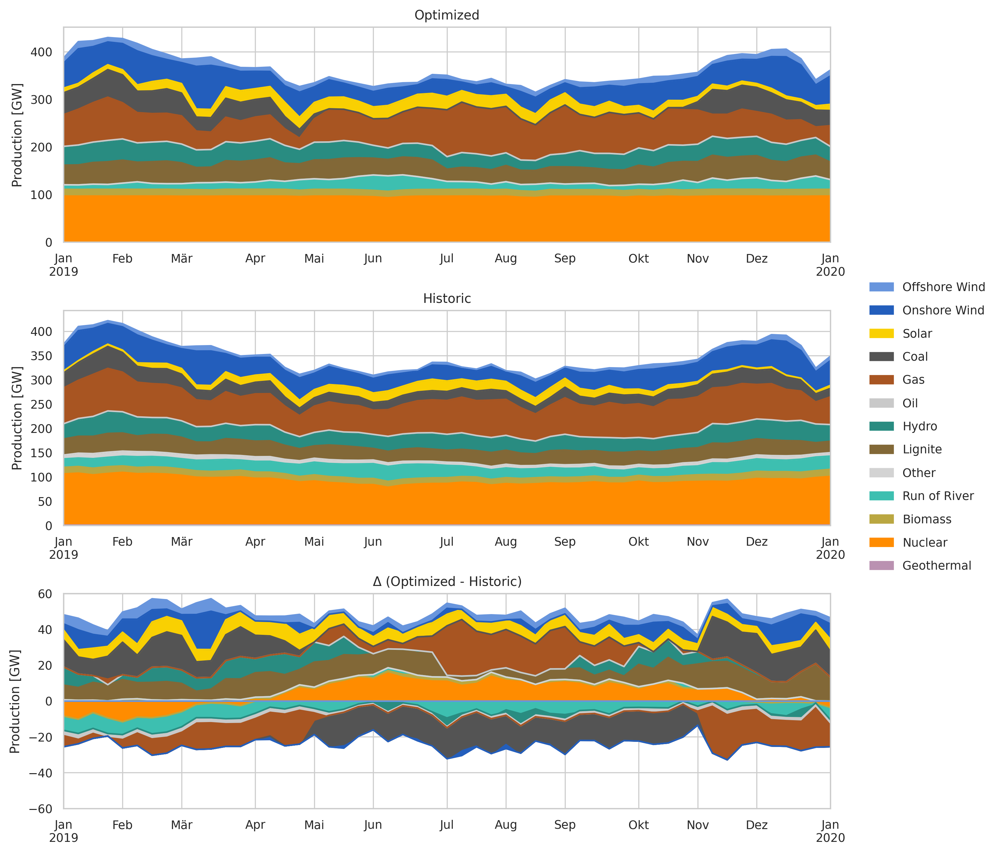
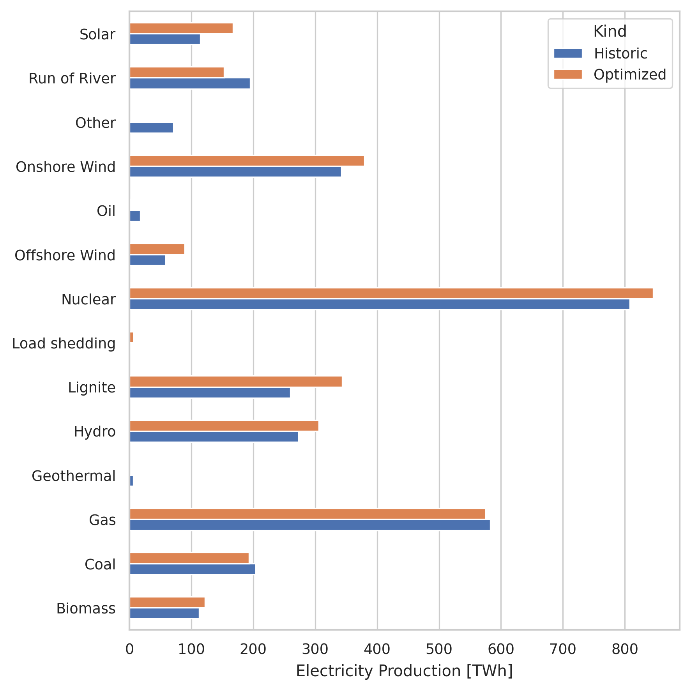

..
  SPDX-FileCopyrightText: Contributors to PyPSA-Eur <https://github.com/pypsa/pypsa-eur>

  SPDX-License-Identifier: CC-BY-4.0

##########################################
Validation
##########################################

The PyPSA-Eur model workflow has been validated by contrasting the outcomes of network optimization against the historical behaviour of the European power system.
These comparisons utilize data from the 2019 ENTSO-E Transparency Platform.
The setup uses monthly varying fuel prices for gas, lignite, coal and oil as well as CO2 prices, which are created by the script :mod:`build_monthly_prices`.

The comparison with the historical data shows partially accurate, partially improvable results. The following figures show the comparison of the dispatch of the different carriers.

Issues and possible improvements
--------------------------------

**Overestimated dispatch of wind and solar:** Renewable potentials of wind and solar are slightly overestimated in the model. This leads to a higher dispatch of these carriers than in the historical data. In particular, the solar dispatch during winter is overestimated.

**Coal - Lignite fuel switch:** The model has a fuel switch from coal to lignite. This might result from non-captured subsidies for lignite and coal in the model. In order to fix the fuel switch from coal to lignite, a manual cost correction was added to the script ``build_monthly_prices``.

**Planned outages of nuclear power plants:** Planned outages of nuclear power plants are not captured in the model. This leads to a underestimated dispatch of nuclear power plants in winter and a overestimated dispatch in summer. This point is hard to fix, since the planned outages are not published in the ENTSO-E Transparency Platform.

**False classification of run-of-river power plants:** Some run-of-river power plants are classified as hydro power plants in the model. This leads to a general overestimation of the hydro power dispatch. In particular, Swedish hydro power plants are overestimated.

**Load shedding:** Due to constraint NTC's (crossborder capacities), the model has to shed load in some regions. This leads to a high market prices in the regions which drive the average market price up. Further fine-tuning of the NTC's is needed to avoid load shedding.
